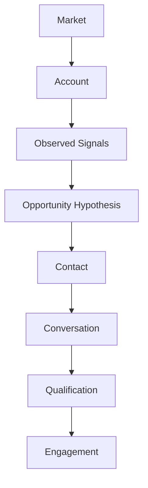

# Sales Engineering Engagement Development Laboratory

This deterministic executable textbook teaches the upstream work **before** a formal Sales Engineering Laboratory engagement: finding and justifying a legitimate opportunity without manufacturing one. It uses educational simulations, not external APIs, fake CRM integrations, autonomous outreach, or probabilistic scores presented as truth.



The reasoning chain is **Market → Account → Signal → Opportunity Hypothesis → Contact → Conversation → Qualification → Engagement**. Every transition needs appropriate evidence. In particular:

- Activity ≠ Progress
- Contact ≠ Opportunity
- Conversation ≠ Qualification
- Qualification ≠ Closed sale
- Analysis ≠ Customer approval

“No qualified opportunity exists yet” is a successful analytical conclusion, not a failure. Inferences remain labeled as inferences and cannot alone support a hypothesis. The examples are fictional and deterministic.

## Run it

Python 3.13 is required.

```bash
python -m pip install -e '.[dev]'
engagement-dev chapter-0
engagement-dev chapter-2
engagement-dev chapter-3
# or
python -m engagement_dev.cli chapter-0
pytest
```

The immutable domain records live in `engagement_dev.domain`; creation policies live in `engagement_dev.services`. This separation makes it easy to inspect both a conclusion and the evidence identifiers behind it. The VS Code **Chapter 0** launch configuration supports stepping through the scenario.

## Chapter roadmap

- [Chapter 0 — From No Engagement to a Legitimate Opportunity](chapters/chapter_00_foundations.md) establishes the evidence-led lifecycle and its handoff boundary.
- [Chapter 1 — Define the Offer Before Looking for Prospects](chapters/chapter_01_define_the_offer.md) establishes **Capability → Problem Class → Evidence of Fit → Investigation Boundary** before market or account selection.
- [Chapter 2 — Choosing a Market](chapters/chapter_02_choosing_a_market.md) implements **Supported Offer → Market Evidence → Market Hypothesis → Investigation Priority** as an allocation-of-attention decision.

Chapter 3 — [Building an Account List](chapters/chapter_03_building_an_account_list.md) implements **Selected Market → Account Evidence → Research Rationale → Account Research Queue** while keeping the queue distinct from an opportunity pipeline.

Chapters 0–3 are implemented. Chapter 4 — **Researching an Account** is planned and is not yet implemented.

Run Chapter 1 with `python -m engagement_dev.cli chapter-1`. Its fictional Northstar Systems Studio scenario evaluates bounded offers, vague language, and overclaims without treating proof of capability as proof of customer need.

## Laboratory boundary

This laboratory ends when there is enough justified evidence to begin a structured sales engineering engagement. The downstream Sales Engineering Laboratory begins there. An `EngagementCandidate` is a handoff candidate—not a closed sale and not customer approval.

Start with [Chapter 0](chapters/chapter_00_foundations.md), continue through [Chapter 1](chapters/chapter_01_define_the_offer.md) and [Chapter 2](chapters/chapter_02_choosing_a_market.md), and then run [Chapter 3](chapters/chapter_03_building_an_account_list.md).
