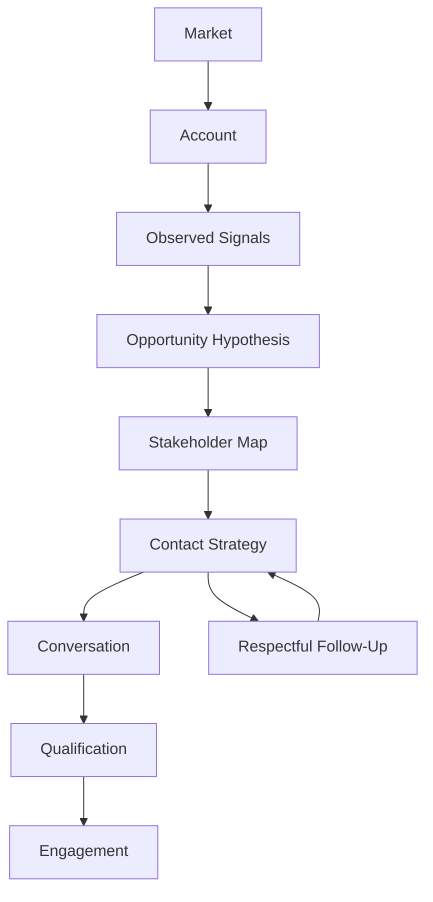

# Sales Engineering Engagement Development Laboratory

This deterministic executable textbook teaches the upstream work **before** a formal Sales Engineering Laboratory engagement: finding and justifying a legitimate opportunity without manufacturing one. It uses educational simulations, not external APIs, fake CRM integrations, autonomous outreach, or probabilistic scores presented as truth.



The reasoning chain is **Market → Account → Signal → Opportunity Hypothesis → Stakeholder Map → Contact Strategy → Conversation → Qualification → Engagement**. Every transition needs appropriate evidence. In particular:

- Activity ≠ Progress
- Contact ≠ Opportunity
- Conversation ≠ Qualification
- Qualification ≠ Closed sale
- Analysis ≠ Customer approval

“No qualified opportunity exists yet” is a successful analytical conclusion, not a failure. Inferences remain labeled as inferences and cannot alone support a hypothesis. The examples are fictional and deterministic.

## Run it

Python 3.13 is required.

```bash
python -m pip install -e '.[dev]'
engagement-dev chapter-0
engagement-dev chapter-2
engagement-dev chapter-3
engagement-dev chapter-4
engagement-dev chapter-5
engagement-dev chapter-6
engagement-dev chapter-7
engagement-dev chapter-8
engagement-dev chapter-9
engagement-dev chapter-10
engagement-dev chapter-11
engagement-dev chapter-12
engagement-dev chapter-13
# or
python -m engagement_dev.cli chapter-0
pytest
```

The immutable domain records live in `engagement_dev.domain`; creation policies live in `engagement_dev.services`. This separation makes it easy to inspect both a conclusion and the evidence identifiers behind it. The VS Code **Chapter 0** launch configuration supports stepping through the scenario.

## Chapter roadmap

- [Chapter 0 — From No Engagement to a Legitimate Opportunity](chapters/chapter_00_foundations.md) establishes the evidence-led lifecycle and its handoff boundary.
- [Chapter 1 — Define the Offer Before Looking for Prospects](chapters/chapter_01_define_the_offer.md) establishes **Capability → Problem Class → Evidence of Fit → Investigation Boundary** before market or account selection.
- [Chapter 2 — Choosing a Market](chapters/chapter_02_choosing_a_market.md) implements **Supported Offer → Market Evidence → Market Hypothesis → Investigation Priority** as an allocation-of-attention decision.

Chapter 3 — [Building an Account List](chapters/chapter_03_building_an_account_list.md) implements **Selected Market → Account Evidence → Research Rationale → Account Research Queue** while keeping the queue distinct from an opportunity pipeline.

[Chapter 4 — Researching an Account](chapters/chapter_04_researching_an_account.md) implements **Account Research Queue → Public Evidence → Account Research Brief → Research Readiness** while preserving facts, observations, inferences, unknowns, provenance, freshness, and conflicts.

[Chapter 5 — Finding and Interpreting Signals](chapters/chapter_05_finding_and_interpreting_signals.md) implements **Account Research Brief → Candidate Observations → Signal Evaluation → Signal Clusters → Investigation Questions**. It preserves **Signal ≠ Problem**, detects duplicate reporting, and creates no opportunity hypothesis.

[Chapter 6 — Forming an Opportunity Hypothesis](chapters/chapter_06_forming_an_opportunity_hypothesis.md) implements **Signal Cluster → Candidate Explanations → Opportunity Hypothesis → Validation Questions**. It preserves assumptions, unknowns, falsification paths, and competing explanations while enforcing **Possible Problem ≠ Proposed Solution**.

[Chapter 7 — Mapping the Buying Organization](chapters/chapter_07_mapping_the_buying_organization.md) implements **Opportunity Hypothesis → Validation Questions → Knowledge Needed → Stakeholder Map → Evidence-Oriented Contact Priority** while preserving unknown authority and sending no outreach.

[Chapter 8 — Designing Evidence-Based Outreach](chapters/chapter_08_designing_evidence_based_outreach.md) implements **Public Evidence + Opportunity Hypothesis + Stakeholder Relevance + Supported Credibility → Outreach Draft → Evidence Validation → READY** while sending no external communication.

[Chapter 9 — Running the First Conversation](chapters/chapter_09_running_the_first_conversation.md) implements **Opportunity Hypothesis → Neutral Validation Questions → Simulated Stakeholder Conversation → Stakeholder Evidence → Hypothesis Update**. It preserves statement provenance, supports refinement and refutation, selects no solution, and creates no qualification.

[Chapter 10 — Qualifying the Opportunity](chapters/chapter_10_qualifying_the_opportunity.md) implements **Customer-Grounded Evidence → Explicit Qualification Dimensions → Deterministic Threshold → Engagement Candidate → Evidence-Backed Handoff**. It is the first chapter permitted to create an `EngagementCandidate`, and does so only when the conservative threshold passes. Budget may remain explicitly unknown; no solution, architecture, deal value, or close probability is assumed.

[Chapter 11 — Managing Follow-Up Without Chasing](chapters/chapter_11_managing_follow_up_without_chasing.md) implements **Prior Interaction + Legitimate Reason + Contextual Timing + Stopping Rule → Simulated Follow-Up or Respectful Stop**. It keeps no response neutral, respects requested timing and strict no-contact states, limits no-response sequences, and never changes qualification or creates an engagement candidate merely because follow-up occurred.

[Chapter 12 — Building and Managing the Engagement Pipeline](chapters/chapter_12_building_and_managing_the_engagement_pipeline.md) implements **Existing Lifecycle Evidence → Derived Pipeline State → Next Justified Action → Capacity Allocation → New Evidence**. It preserves state history and regression, separates activity from progress, protects silent accounts, enforces simple WIP limits, and excludes fake revenue forecasts and close probabilities.

[Chapter 13 — Learning From Rejection, Closure, and Lost Opportunities](chapters/chapter_13_learning_from_rejection_closure_and_lost_opportunities.md) implements **Outcome Evidence → Closure or Defer Decision → Observed Reason → Supported Learning → Reopen Trigger**. It preserves pipeline history, accepts `UNKNOWN`, separates closure levels, rejects unsupported narratives, and prevents account evidence from becoming a market generalization.

Chapters 0–13 are implemented. Chapter 10 completes the first major qualification lifecycle; Chapter 11 adds evidence-driven follow-up branches; Chapter 12 composes multiple accounts into an evidence-state portfolio without creating a parallel source of truth. Chapter 13 appends evidence-backed closure, bounded learning, and legitimate reopen triggers while preserving that history.

Run Chapter 1 with `python -m engagement_dev.cli chapter-1`. Its fictional Northstar Systems Studio scenario evaluates bounded offers, vague language, and overclaims without treating proof of capability as proof of customer need.

## Laboratory boundary

This laboratory ends when there is enough justified evidence to begin a structured sales engineering engagement. The downstream Sales Engineering Laboratory begins there. An `EngagementCandidate` is a handoff candidate—not a closed sale and not customer approval.

Start with [Chapter 0](chapters/chapter_00_foundations.md), continue sequentially through the simulated discovery conversation in [Chapter 9](chapters/chapter_09_running_the_first_conversation.md), cross the boundary carefully in [Chapter 10](chapters/chapter_10_qualifying_the_opportunity.md), practice respectful continuation and stopping in [Chapter 11](chapters/chapter_11_managing_follow_up_without_chasing.md), manage the evidence-state portfolio in [Chapter 12](chapters/chapter_12_building_and_managing_the_engagement_pipeline.md), and learn conservatively from closure in [Chapter 13](chapters/chapter_13_learning_from_rejection_closure_and_lost_opportunities.md).

The recommended next chapter is **Chapter 14 — Engagement Development Analytics and Continuous Improvement**: aggregate historical evidence transitions without mistaking activity metrics for causal proof or sales skill.
