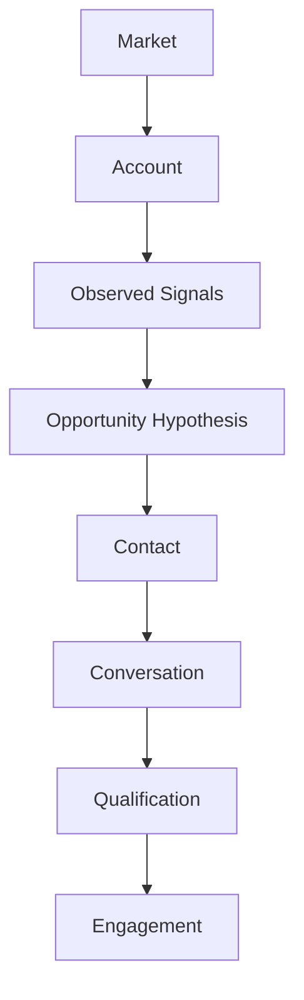

# Sales Engineering Engagement Development Laboratory

This deterministic executable textbook teaches the upstream work **before** a formal Sales Engineering Laboratory engagement: finding and justifying a legitimate opportunity without manufacturing one. It uses educational simulations, not external APIs, fake CRM integrations, autonomous outreach, or probabilistic scores presented as truth.



The reasoning chain is **Market → Account → Signal → Opportunity Hypothesis → Contact → Conversation → Qualification → Engagement**. Every transition needs appropriate evidence. In particular:

- Activity ≠ Progress
- Contact ≠ Opportunity
- Conversation ≠ Qualification
- Qualification ≠ Closed sale
- Analysis ≠ Customer approval

“No qualified opportunity exists yet” is a successful analytical conclusion, not a failure. Inferences remain labeled as inferences and cannot alone support a hypothesis. The examples are fictional and deterministic.

## Run it

Python 3.13 is required.

```bash
python -m pip install -e '.[dev]'
engagement-dev chapter-0
# or
python -m engagement_dev.cli chapter-0
pytest
```

The immutable domain records live in `engagement_dev.domain`; creation policies live in `engagement_dev.services`. This separation makes it easy to inspect both a conclusion and the evidence identifiers behind it. The VS Code **Chapter 0** launch configuration supports stepping through the scenario.

## Laboratory boundary

This laboratory ends when there is enough justified evidence to begin a structured sales engineering engagement. The downstream Sales Engineering Laboratory begins there. An `EngagementCandidate` is a handoff candidate—not a closed sale and not customer approval.

Start with [Chapter 0](chapters/chapter_00_foundations.md).
