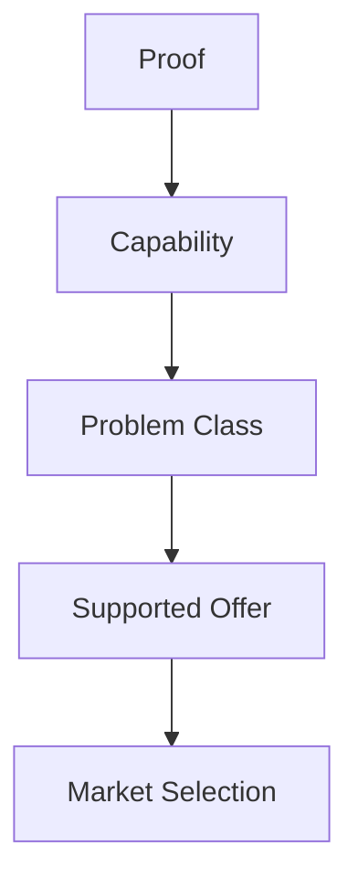

# Chapter 1 — Define the Offer Before Looking for Prospects


## Purpose

Engagement development begins by asking **“What kinds of business problems are we actually qualified to investigate?”**, not by finding a company and inventing a reason it might need us. Chapter 0's evidence discipline still applies. Chapter 1 adds an upstream filter:

**Provider Capability → Supported Offer → Relevant Problem Classes → Market Selection → Account Investigation**

## Learning objectives

After this chapter, you can:

1. Distinguish a capability, problem class, proof artifact, boundary, and offer.
2. Connect demonstrated capabilities to recognizable problem classes.
3. Reject vague offers and unsupported guaranteed outcomes with explainable rules.
4. Preserve investigation boundaries before any customer discovery has occurred.
5. Use a supported offer as a future market-selection filter.

## Concepts

- A **capability** is something the provider can demonstrably do.
- A **problem class** is a reusable category such as system integration or manual workflow—not an assumed problem at a named account.
- A **proof artifact** demonstrates a capability. The fictional laboratories and prototype are educational artifacts, never claimed customer engagements.
- A **boundary** states what the provider has not established, should not promise, or lacks expertise to undertake.
- A **service offer** connects those four concepts into an inspectable investigation proposition.

The governing distinction is **proof of capability ≠ proof of customer need**. A portfolio can establish, “We know how to investigate this type of system.” It cannot establish, “This particular company needs our solution.”



## Domain model and evaluation rules

The immutable `CapabilityProfile` holds Northstar Systems Studio's deliberately modest capabilities, proof, and boundaries. A `ServiceOffer` selects capabilities, `ProblemClass` records, `ProofArtifact` records, and `OfferBoundary` records without duplicating Chapter 0's account evidence model.

`OfferEvaluator` applies ordered, explicit rules rather than an arbitrary score:

1. A promise or universal outcome is `OVERCLAIMED`.
2. An identifier absent from the provider profile is `OUTSIDE_CAPABILITY`.
3. No recognizable category is `NO_PROBLEM_CLASS`.
4. A problem class without a relevant selected capability is `OUTSIDE_CAPABILITY`.
5. A selected capability without selected supporting proof is `INSUFFICIENT_PROOF`.
6. Otherwise the bounded investigation is `SUPPORTED`.

These statuses evaluate whether an offer is grounded. They do not predict a sale or prove that a customer has a problem.

## Executable example

Northstar Systems Studio demonstrates Python and web development, REST API integration, relational data modeling, workflow automation, testing, and prototyping. Its fictional proof artifacts are the Inventory Synchronization Laboratory, Digital Banking Systems Laboratory, and Workflow Prototype. It explicitly does **not** offer specialized security audits, regulatory certification, industrial control engineering, guaranteed ROI, or implementation before discovery.

Run:

```bash
python -m engagement_dev.cli chapter-1
```

The report evaluates four fixed candidates. Offers A and D are bounded investigations and are supported. “We use AI to revolutionize any business” overgeneralizes without identifying a grounded investigation. A guaranteed 40% cost reduction promises a customer result that neither technical proof nor pre-discovery analysis can establish.

## Debugger exercise

Choose **Debug Chapter 1 Offer Evaluation** in VS Code. Place a breakpoint in `OfferEvaluator.evaluate`, then step through `examples/debug_offer_evaluation.py`. Inspect:

- the selected `capability` identifier;
- each `problem` class and its relevant capability identifiers;
- `proof_by_id` and the selected supporting proof;
- the offer's immutable `boundaries`; and
- the resulting status and findings.

The script evaluates one offer rather than launching the full CLI so the policy remains easy to inspect.

## Interpretation

An offer is a filter, not a conclusion about a prospect. Chapter 0 established **Market → Account → Signal → Opportunity Hypothesis → Contact → Conversation → Qualification → Engagement**. Chapter 1 constrains what can enter the beginning of that lifecycle. Do not ask, “How can I sell something to this company?” Ask, **“Does this company show evidence of a problem class that falls within the capabilities I can credibly investigate?”**

## Common mistakes

- Calling “we build software” or “we provide AI solutions” a useful offer.
- Treating broad technical familiarity as proof of every specialized capability.
- Treating a demonstration or portfolio item as proof of customer pain.
- Claiming ROI, urgency, or suitability before discovery.
- Assuming automation, system replacement, or custom software is necessarily appropriate.
- Quietly adding a capability because a possible prospect appears to require it.

## Connection to the next chapter

Chapter 2 should use the supported offer and its problem classes to choose markets worth investigating. It should not treat every company as a prospect, infer account pain, or weaken the boundaries established here.
