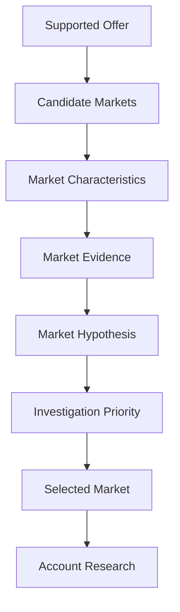

# Chapter 2 — Choosing a Market

## Purpose

Given what we can credibly offer, where should we look for potential engagements? Chapter 2 treats market selection as an **allocation-of-attention decision**, not proof of customer need. Identify markets whose observable characteristics make supported problem classes plausible enough to justify further investigation. Never pick an industry and assume it needs a service.

## Learning objectives

After this chapter, you can:

1. Distinguish a market characteristic, market evidence, and a cautious market hypothesis.
2. Match observed characteristics to Chapter 1's supported problem classes without manufacturing account pain.
3. Apply provider boundaries and accept insufficient evidence as a valid result.
4. Explain a deterministic investigation priority without a magical lead score.
5. Allocate limited research capacity while keeping deferred markets distinct from rejected markets.

## Research foundations and educational framing

Market research narrows where account research should begin. It does not qualify an account or forecast revenue. The governing distinctions are:

- Market ≠ Account.
- Market fit ≠ Customer need.
- Market attractiveness ≠ Guaranteed revenue.
- Large market ≠ Good market.
- Interesting industry ≠ Relevant problem class.
- Provider familiarity ≠ Evidence of opportunity.
- Market hypothesis ≠ Qualified opportunity.

A characteristic such as “hotels use multiple operational systems” is not the conclusion “this hotel has an integration problem.” It only supplies a question that may merit research.



## Domain model

Chapter 0's `Market` remains the lifecycle market and now supports an optional description. `MarketCharacteristic` records a pattern and possible problem-class relevance. `MarketEvidence` records its provenance. `MarketHypothesis` retains the market, relevant problem classes, evidence IDs, explicit assumptions, and reason to investigate. `MarketEvaluation` makes the rule outcome and findings inspectable. `InvestigationPriority` describes research attention—not sales value.

## Evidence discipline

Market evidence extends the shared `EvidenceCategory` rather than inventing a parallel taxonomy: `PUBLIC_MARKET_DATA`, `INDUSTRY_PATTERN`, `OBSERVED_TECHNOLOGY_PATTERN`, and `PROVIDER_EXPERIENCE` are observed categories; `INFERENCE` remains explicitly non-observed. A hypothesis retains supporting evidence identifiers. Inference alone produces `INSUFFICIENT_EVIDENCE`.

Evidence strength increases as the laboratory moves downstream:

| Level | Justified statement |
|---|---|
| **MARKET LEVEL** | “We have evidence that this market is worth investigating.” |
| **ACCOUNT LEVEL** | “We have evidence that this particular organization is worth investigating.” |
| **OPPORTUNITY LEVEL** | “We have evidence supporting a specific problem hypothesis.” |
| **QUALIFICATION LEVEL** | “We have direct enough evidence to justify an engagement.” |

## Executable scenario

The fixed scenario loads Chapter 1's provider profile and a bounded supported offer. It evaluates Regional Hospitality, Independent Retail & Specialty Stores, Professional Services, Industrial Control Engineering, and a weak-evidence market. Characteristics are matched only to problem classes in the offer. Direct market evidence is required. The industrial market triggers the provider's industrial-control boundary even though its systems are technically interesting.

Ordered rules are intentionally simple:

1. An explicit provider boundary produces `OUTSIDE_SUPPORTED_OFFER`.
2. No overlap with a supported problem class, or no observed supporting evidence, produces `INSUFFICIENT_EVIDENCE`.
3. At least two relevant problem classes and two observed evidence records produce `PRIORITIZE_FOR_RESEARCH`.
4. Other supported, evidenced overlap produces `WORTH_INVESTIGATING`.

These rules are research triage, not a numerical lead score, prediction, or proof that an account has a problem.

## CLI usage

```bash
python -m engagement_dev.cli chapter-2
```

The report displays each market's characteristics, evidence, relevant supported problem classes, boundary, hypothesis when justified, and evaluation. It then applies two deep-research slots. Hospitality and retail are selected; professional services is deferred; industrial control is rejected; and the weak market remains insufficiently evidenced.

## Debugger exercise

Choose **Debug Chapter 2 Market Evaluation** in VS Code. Place a breakpoint inside `MarketEvaluator.evaluate`, then step through `examples/debug_market_evaluation.py`. Inspect `supported_offer`, `market`, `characteristics`, `evidence`, `relevant`, `profile.boundaries`, and the resulting evaluation. Manually confirm that evidence IDs belong to the market and that only supported problem classes survive.

## Interpretation

The provider cannot investigate every market equally. Time spent deeply researching one cannot simultaneously be spent on another. Capacity selects two eligible markets in stable scenario order; it does not rewrite evidence or use an optimization algorithm. **Deferred does not mean bad**. It means not currently selected given available evidence and research capacity.

This makes Chapter 0's first transition executable:

**Supported Offer → Candidate Markets → Market Research → Selected Market → Account Research**

## Common mistakes

- Turning a general industry pattern into a claim about a particular organization.
- Treating market size, familiarity, technical complexity, or enthusiasm as evidence of fit.
- Presenting a market priority as revenue, qualification, or customer approval.
- Hiding inference inside language that sounds observed.
- Ignoring Chapter 1 boundaries when a market looks interesting.
- Calling a capacity-deferred market rejected.

## Connection to Chapter 3

Chapter 3 — **Building an Account List** should take a selected market and ask, “Which specific organizations are worth researching?” It must preserve the central rule: **being in an attractive market does not automatically make an organization a prospect**. Chapter 2 creates no account opportunities.
