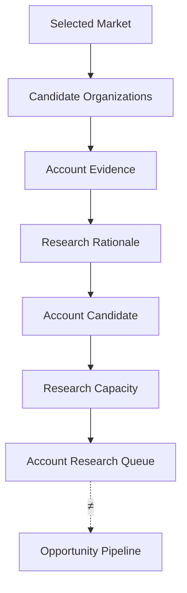

# Chapter 3 — Building an Account List


## Purpose

Once a market is worth investigating, which specific organizations deserve account-level research? Chapter 3 moves from market reasoning to an account **research queue**. It does not create a pipeline. Membership in an attractive market does not make an organization an opportunity.

**Proof → Capability → Supported Offer → Candidate Markets → Selected Market → Account List**

## Learning objectives

After this chapter, you can:

1. Distinguish a market, account, prospect, and opportunity.
2. Preserve provenance while separating account evidence from interpretation.
3. Explain why public characteristics justify questions, not claims of customer pain.
4. Distinguish absence of evidence from negative evidence.
5. Build a deterministic account research queue under limited capacity.
6. Explain why selection creates neither an opportunity hypothesis nor an engagement candidate.

## Concepts and boundaries

- Market ≠ Account.
- Account ≠ Prospect.
- Prospect ≠ Opportunity.
- Organization size ≠ Opportunity quality.
- Recognizable brand ≠ Good target.
- Local proximity ≠ Customer need.
- Technology usage ≠ Technology problem.
- Job posting ≠ Buying intent.
- Account list ≠ Qualified pipeline.

An organization belongs on the list only when available evidence makes additional research reasonable. Nothing more is inferred.



## Evidence discipline

`AccountEvidence` is a sourced public observation. `AccountInterpretation` is the analyst's cautious reading and retains the evidence identifiers it interprets. The fictional sources make provenance executable offline and can later be replaced with researched records without changing selection policy.

| Kind | Example | Permitted conclusion |
|---|---|---|
| Evidence | “The account operates multiple properties.” | A sourced public characteristic exists. |
| Interpretation | “Cross-property workflows may warrant research.” | A question is worth investigating. |
| Unsupported claim | “The account has a synchronization problem.” | **Not permitted.** |

A public integration-developer job posting could support the interpretation that an organization may be investing in integration. It does not establish buying intent or a need for an external consultant.

**Absence of evidence** means “we do not currently know enough” and produces `INSUFFICIENT_EVIDENCE`. **Negative evidence** is an observation suggesting the account is inappropriate for this investigation. For example, centralized platform control with no local discretion produces cautious deferral. These outcomes are not equivalent.

## Domain model

Chapter 0's modest immutable `Account` is extended with optional organization description, location, observed characteristics, evidence references, and research status. Its original three-argument constructor remains valid. It has no deal value, probability, sales stage, or forecast.

`AccountCandidate` references the account, the actual selected `Market`, supporting `AccountEvidence`, relevant market characteristics, supported problem classes, and a research rationale. It means **“this organization is worth researching,”** never “this organization has a problem we can solve.”

## Account-selection rules

`AccountListBuilder` applies ordered rules rather than an arbitrary numerical lead score:

1. An account outside the selected market is `OUTSIDE_SELECTED_MARKET`.
2. Applicable negative evidence is `DEFERRED` with an explicit cautious reason.
3. Fewer than two relevant observed records, or no supported problem-class overlap, is `INSUFFICIENT_EVIDENCE`.
4. Eligible accounts enter transparent priority categories: recent change plus complexity, multiple relevant characteristics, then sufficient public information.
5. Priority category and alphabetical account name provide deterministic ordering and tie-breaking.
6. Capacity selects only the first eligible accounts; remaining eligible accounts are `DEFERRED`, not rejected.

The factors are reasons to investigate, not predictions of buying behavior.

## Executable scenario and CLI usage

The deterministic Regional Hospitality scenario includes eight fictional organizations and three deep-research slots. Blue Heron Resort, Colonial Harbor Hotel, and Seaside Conference Suites have multiple sourced operational characteristics. Tidewater Inn remains eligible but deferred by capacity. A centralized-platform notice is negative evidence for Harborview Flagged Hotel. Heritage Lodging Group and Sandpiper Guest House lack enough relevant evidence. Peninsula Industrial Controls is outside the selected market.

```bash
python -m engagement_dev.cli chapter-3
```

The report displays evidence with fictional source descriptions, interpretations, rationale, every non-selected outcome, summary counts, and zero qualified opportunities.

## Debugger exercise

Choose **Debug Chapter 3 Account Selection** in VS Code. Set a breakpoint in `AccountListBuilder.build` and compare `blue-resort` with `tidewater-inn`. Inspect:

- `selected_market` and `supported_offer`;
- each `account`, its `account_evidence`, and separate `account_interpretations`;
- `relevant`, `supporting`, and the relevant problem classes;
- the candidate's `research_rationale` and priority category;
- `research_capacity`, `selected_ids`, and final status.

Blue Heron is selected because explicit recent-change and complexity rules place it ahead. Tidewater is deferred because stronger justified candidates consume the three slots—not because Tidewater was rejected.

## Evidence ladder

**MARKET EVIDENCE** — “This market is worth investigating.”

↓

**ACCOUNT EVIDENCE** — “This organization is worth researching.”

↓

**SIGNAL EVIDENCE** — “Something observable may indicate a specific problem class.”

↓

**OPPORTUNITY HYPOTHESIS** — “A specific problem may be worth validating.”

↓

**STAKEHOLDER EVIDENCE** — “A person inside the organization confirms or refutes the hypothesis.”

↓

**QUALIFICATION** — “Enough evidence exists to justify an engagement.”

Chapter 3 intentionally stops at the second level: **account evidence**.

## Interpretation

The output is an ordered allocation of research attention. Selection does not validate pain, urgency, authority, budget, local discretion, technology fit, buying intent, or willingness to engage. `DEFERRED` preserves a justified candidate for a later research cycle. `INSUFFICIENT_EVIDENCE` invites careful evidence collection rather than guessing.

## Common mistakes

- Copying every market member into a “prospect” list.
- Ranking recognizable, large, or nearby organizations without relevant evidence.
- Calling technology use a technology problem or a job posting buying intent.
- Hiding interpretations inside evidence descriptions.
- Treating missing public information as negative evidence.
- Treating negative evidence as permanent rejection.
- Calling a capacity-deferred account unqualified.
- Adding CRM deal fields when no deal exists.
- Turning research rationale into an opportunity hypothesis.

## Connection to Chapter 4

Chapter 4 — **Researching an Account** should ask: **“What can we responsibly learn about a selected organization before contacting anyone?”** It should deepen research on selected accounts and identify specific observable signals without inventing customer pain. Chapter 4 is not implemented here.
