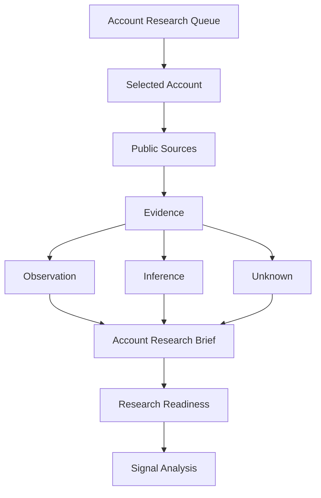

# Chapter 4 — Researching an Account


## Purpose

What can we responsibly learn about a selected organization before contacting anyone? Chapter 4 assembles an evidence-based account brief from ordinary fictional public information. It asks **“What do we know?”** before **“What do we think might be happening?”** It creates neither an opportunity hypothesis nor qualification.

## Learning objectives

After this chapter, you can separate `FACT`, `OBSERVATION`, `INFERENCE`, and `UNKNOWN`; preserve provenance; interpret categorical reliability and freshness; retain contradictions; use corroboration cautiously; and apply an explicit research stopping rule.

## Concepts and research dimensions

- **Organization:** business model, properties, services, customers, and structure.
- **Operations:** reservations, events, scheduling, payments, and delivery workflows.
- **Technology:** publicly named portals, platforms, applications, vendors, or systems roles—not invasive fingerprinting.
- **Change:** expansion, hiring, services, migrations, acquisitions, or restructuring.
- **People:** relevant roles, without assuming authority or making them outreach targets.
- **Unknowns:** material questions public evidence cannot answer.

A fact is a bounded, directly asserted state. An observation records what a source publicly presents. An inference is an analyst interpretation with evidence references. An unknown records uncertainty as first-class data. These labels must not collapse into each other.



## Evidence provenance and source reliability

Every research record retains an identifier, account, source name, source type, observed date, dimension, classification, and relevant supported problem-class references. Primary public sources are the organization's own website, posting, or release. Secondary public sources include fictional news and directories. An unverified public claim is explicitly weak. These are categorical descriptions, not a 0–100 truth score.

## Evidence freshness

Freshness uses the fixed scenario date `2026-08-01`: evidence aged 0–90 days is `CURRENT`, 91–365 days is `AGING`, and older evidence is `STALE`. Future-dated evidence is invalid. Old evidence can remain historically accurate while being unsafe as a description of current conditions.

## Corroboration and contradictory evidence

Independent items can strengthen a bounded observation. The properties page, expansion release, job posting, and platform release together make change worth examining. They do **not** prove inefficiency or pain. Likewise, the stale report of partly manual booking and current platform announcement remain in the brief. Recency and primary provenance change interpretation; they do not erase history.

## Unknowns and stopping rules

The brief explicitly asks whether systems are integrated, duplicate entry occurs, management sees a problem, a project exists, outside help is acceptable, and budget exists. It does not fill these gaps with assumptions.

Stop broad account research when enough evidence identifies specific observations worth analyzing, or additional public research is unlikely to materially improve the brief. `AccountResearchEvaluator` requires organization evidence, an operational observation, provenance, and explicit unknowns. Unresolved conflicts require review. This is readiness for signal analysis—not opportunity scoring.

> **PUBLIC EVIDENCE ≠ CUSTOMER CONFIRMATION**

> Research should reduce uncertainty.  
> It should not hide uncertainty.

## Executable scenario and CLI usage

Blue Heron Resort is selected from Chapter 3. Run:

```bash
python -m engagement_dev.cli chapter-4
```

The deterministic report displays public sources, claim categories, dimensions, freshness, inference references, corroboration, conflicting evidence, unknowns, and research readiness. Its conclusion is `RESEARCH_READY`, while stating that no customer problem, opportunity hypothesis, or engagement candidate exists.

## Debugger exercise

Choose **Debug Chapter 4 Account Research** in VS Code. Set a breakpoint in `AccountResearchEvaluator.evaluate` and inspect `research_evidence`, `source_type`, `source_reliability`, `freshness`, `observation`, `inference`, `unknown`, `evidence_conflicts`, and `research_readiness_result`. The focused helper avoids stepping through report formatting.

## Interpretation

The platform announcement is current primary evidence. It does not prove every workflow is integrated. The historical article remains useful context but is stale. Expansion and systems hiring justify closer questions, not claims about urgency, cost, budget, authority, requirements, or willingness to buy.

## Common mistakes

- Converting public technology usage into a technology problem.
- Treating a title as proof of authority or a job posting as buying intent.
- Silently discarding contradictory or stale evidence.
- Calling corroboration customer confirmation.
- Researching indefinitely instead of applying a stopping rule.
- Replacing unknowns with plausible-sounding invented details.

## Connection to Chapter 5

Chapter 5 — **Finding and Interpreting Signals** should ask: **Which observations from our account research are meaningful enough to justify investigating a possible business problem?** It should transform selected observations into explicit signals while preserving **Signal ≠ Problem**. A signal means, “This observation gives us a reason to ask a better question,” never, “We have proven that the customer needs our solution.”
