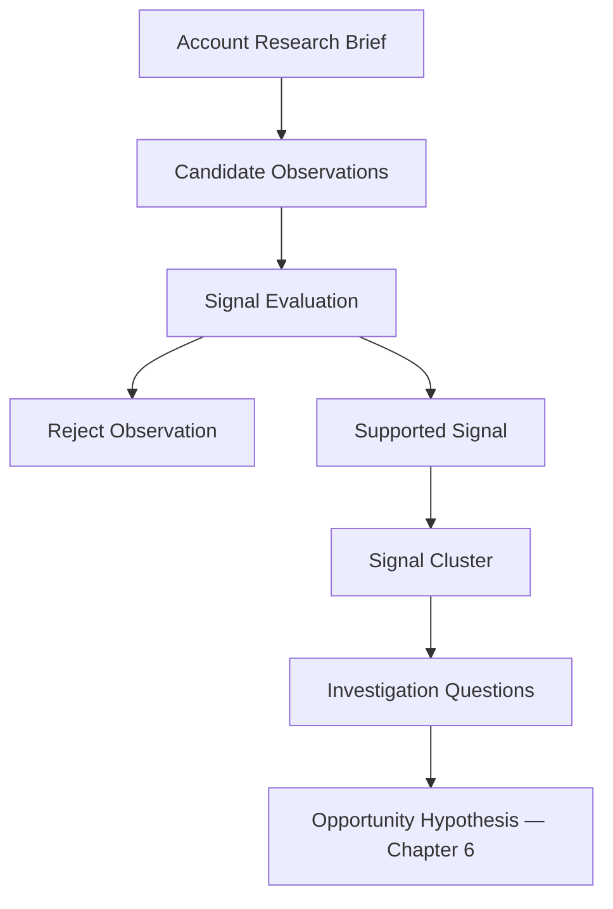

# Chapter 5 — Finding and Interpreting Signals

## Purpose

Which observations from account research are meaningful enough to justify investigating a possible business problem? Chapter 5 implements **Account Research Brief → Signal Analysis → Investigation Questions**. It does not form an opportunity hypothesis.

> **Signal ≠ Problem**  
> **Strong Signal ≠ Qualified Opportunity**

A signal means, **“This observation gives us a reason to ask a better question.”** It never means that customer pain, purchase intent, urgency, or provider fit has been proven.

## Learning objectives

After this chapter, you can classify observations with an explicit taxonomy; keep observation, possible meaning, problem-class relevance, and unknowns separate; evaluate freshness without rewriting history; distinguish independent corroboration from duplicate reporting; reject false positives; interpret negative signals; build only coherent clusters; and write assumption-aware, falsifiable investigation questions.



## Signal taxonomy and structure

`ObservedSignal` is extended rather than replaced. `SignalType` describes what was observed: `HIRING`, `EXPANSION`, `NEW_LOCATION`, `NEW_PRODUCT_OR_SERVICE`, `TECHNOLOGY_CHANGE`, `PLATFORM_MIGRATION`, `ORGANIZATIONAL_CHANGE`, `ACQUISITION`, `PUBLIC_COMPLAINT`, `PROCESS_CHANGE`, `REGULATORY_CHANGE`, `PROCUREMENT_ACTIVITY`, `LEADERSHIP_CHANGE`, or `VENDOR_CHANGE`. Type is descriptive, not a relevance ranking.

A Chapter 5 signal retains its identifier, account, type, observation, composed `AccountEvidence`, observation date, Chapter 4 freshness category, source provenance, underlying event, polarity, and `SignalInterpretation`. Evidence must be direct, account-specific, and nonempty for evaluator support. The original Chapter 0 constructor remains compatible.

## Interpretation and strength

`SignalInterpretation` explicitly separates:

- **Observation:** what happened, copied from evidence;
- **Possible meaning:** cautious analyst interpretation;
- **Relevant problem classes:** only classes within the supported offer may pass evaluation;
- **Unknowns:** questions required before a stronger conclusion.

`WEAK`, `MODERATE`, and `STRONG` describe only how strongly evidence justifies **further investigation**. They are not numbers and never represent purchase probability, closing probability, deal value, pain severity, or likelihood of hiring the provider. A current, specific observation with a clear supported-problem-class connection is moderate while uncertainty remains. Multiple independent, current events sharing a problem class can make a cluster strong. Stakeholder validation is still required.

## Explainable signal evaluation

`SignalEvaluator` applies ordered categorical rules:

1. Missing or non-direct evidence → `INSUFFICIENT_EVIDENCE`.
2. Generic marketing language → `INSUFFICIENT_EVIDENCE`.
3. Evidence older than Chapter 4's 365-day aging window → `STALE_SIGNAL`.
4. No explicit supported-offer overlap → `OUTSIDE_SUPPORTED_OFFER`.
5. Otherwise → `SIGNAL_SUPPORTED` with `MODERATE` investigative strength.

The result vocabulary also reserves `SIGNAL_WEAK` and `CONFLICTING_EVIDENCE` for future evidence configurations. Every outcome explains its reason; none is a lead score.

## Corroboration, duplication, and clusters

**Corroboration** comes from independent underlying events that support a related interpretation. **Duplication** occurs when several pages repeat one announcement. Blue Heron's press release and three fictional articles share `event-fourth-property`; they are four reports but one event. They cannot manufacture four independent signals.

`SignalCluster` requires one account, at least two signals, and a shared relevant problem class. This prevents unrelated observations from being bundled merely to make an account appear attractive. Expansion, systems hiring, and a reservation-platform change are independent events sharing system-coordination relevance. Together they support a strong basis to investigate **Operational Scaling and Systems Coordination**, not a proven scaling failure.

## False positives and negative signals

“We are committed to innovation” is generic marketing copy, not a specific operational event, and is rejected. Other likely false positives include perennial generic vacancies, old announcements, broad transformation rhetoric, and unexplained technology logos.

Negative signals modify interpretation rather than automatically eliminating an account. The current platform deployment may weaken or obsolete the old manual-booking interpretation. A completed project, filled role, standardized platform, or closed unit can similarly reduce priority. The learner retains both records and asks what remains true.

## Freshness and decay

Chapter 4's fixed scenario date and categories are reused: 0–90 days is `CURRENT`, 91–365 is `AGING`, and more than 365 days is `STALE`. The 2024 manual-coordination article may remain historically true; it is stale as evidence of present operations. **Historical truth does not imply current investigative relevance.**

## Investigation questions and falsifiability

Questions investigate rather than smuggle in conclusions. Prefer “How do reservations move between the central platform and other workflows?” over “How much are broken integrations costing?” Each supported signal retains unresolved questions, and the cluster adds cross-signal questions.

A useful question must permit discovery that there is a problem, there is no problem, the problem differs from expectations, or the issue has already been solved. Discovering no opportunity is a successful evidence-driven result.

## Executable scenario and CLI

Blue Heron Resort's Chapter 4 brief supplies an expansion announcement, systems-coordinator posting, platform deployment, stale manual-workflow article, and generic marketing statement. Chapter 5 adds three duplicate fictional reports of the expansion event. Run:

```bash
python -m engagement_dev.cli chapter-5
```

The deterministic report prints supported signals, interpretations, strengths, unknowns, negative-signal effects, the justified cluster, rejected observations, duplicate-event accounting, and status. It ends with three supported signals, two rejected observations, one cluster, and zero validated hypotheses.

## Debugger exercise

Choose **Debug Chapter 5 Signal Evaluation** in VS Code. At the first marked line in `examples/debug_signal_evaluation.py`, inspect `candidate_observation`, `evidence`, `signal_type`, `freshness`, `underlying_event`, `relevant_problem_classes`, `interpretation`, `unresolved_questions`, `signal_strength`, and `evaluator_result`. At the second marked line, step into cluster construction and inspect shared problem classes and distinct event identifiers.

## Interpretation

Blue Heron's expansion and hiring could increase coordination requirements. Its platform deployment could be an active change and evidence that an older concern has already been addressed. These readings coexist. The correct output is a better set of questions—not “Blue Heron has broken systems.”

## Common mistakes

- Treating a type or strength as a purchase score.
- Repeating an announcement and counting each article as independent corroboration.
- Converting hiring, expansion, or technology use directly into customer pain.
- Hiding possible meaning inside the observation field.
- Grouping unrelated events into an attractive-looking cluster.
- Discarding stale or negative evidence instead of changing current interpretation.
- Asking loaded questions that assume broken workflows, cost, urgency, or buying intent.
- Creating an opportunity hypothesis or engagement candidate during signal analysis.

## Connection to Chapter 6

Chapter 6 — **Forming an Opportunity Hypothesis** should ask: **Given the signals we have observed, what specific business problem might be worth validating?** It should turn selected questions into a specific, evidence-linked, falsifiable hypothesis. That hypothesis must remain provisional until stakeholder evidence confirms or refutes it.
