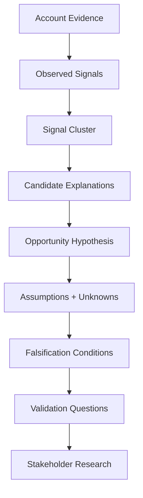

# Chapter 6 — Forming an Opportunity Hypothesis

## Purpose

Given the signals we have observed, **what specific business problem might be worth validating?** Chapter 6 crosses an epistemic boundary from “something is worth investigating” to “a specific explanation is worth testing”—never to “we know the customer has this problem.”

**Supported Offer → Selected Market → Account Research → Observed Signals → Signal Cluster → Opportunity Hypothesis → Stakeholder Validation**

## Learning objectives

After this chapter, you can:

1. Construct a specific, evidence-linked, falsifiable possible-problem proposition.
2. Trace every hypothesis through its signal cluster to account evidence.
3. Keep assumptions and unknowns distinct from facts.
4. Reject certainty, customer-intent claims, and solution-first reasoning.
5. Preserve competing explanations and actively seek disconfirming evidence.
6. Write neutral validation questions that can reveal success as well as difficulty.

## What is an opportunity hypothesis?

An **opportunity hypothesis** is a specific, evidence-linked, falsifiable proposition about a possible business problem worth validating with the organization. It is not a confirmed customer problem, opportunity, deal, requirement, project, proposal, forecast, or evidence that the customer wants help.

> Opportunity Hypothesis ≠ Confirmed Problem  
> Possible Problem ≠ Proposed Solution  
> Evidence ≠ Assumption

The normal successful Chapter 6 state is `SUPPORTED_FOR_VALIDATION`, not `VALIDATED`. Validation requires later stakeholder evidence.



## Evidence chain

The model stores each evidence-to-signal link, the cluster identifier, and the hypothesis. Chapter 6 can therefore render **fourth-property announcement → `EXPANSION` → Operational Scaling and Systems Coordination → possible coordination requirements**. Duplicate articles remain reports of one event, not extra independent signals. A conclusion can always be inspected backward.

## Problem before solution

“Blue Heron Resort needs a custom API integration platform” jumps from observations to a prescription. The evaluator returns `SOLUTION_PREMATURE`. A proper statement first asks whether information or coordination is difficult. Only after validation should someone consider integration, process redesign, configuration, training, an existing product, custom software, or no intervention.

Cautious language—*may*, *might*, *could*, *potentially*, or *investigating whether*—signals the proposition's status. The evaluator does more than ban words: it considers the combination of prescriptive verbs and solution nouns, the structured problem-class scope, evidence freshness, and whether stakeholder evidence exists for a claim of customer intent. Unsupported failure or certainty remains insufficient.

## Assumptions and unknowns

The immutable `Assumption` ledger records necessary but unestablished propositions with `UNVALIDATED`, `SUPPORTED`, or `REFUTED` status. Assumption identifiers never enter `evidence_ids`. Unvalidated assumptions do not prevent investigation, but they cannot silently become facts.

Unknowns remain expected. Categories include problem existence and severity, current process, technical environment, business impact, stakeholder, urgency, budget, decision process, and acceptance of external help. Carrying them forward prevents an attractive explanation from concealing what is not known.

## Falsifiability

Every candidate supplies conditions that could weaken or refute it: unified workflows may already handle expansion, the job may be replacement hiring, stakeholders may report no material difficulty, or the initiative may already be complete. Research should seek these outcomes, not merely confirmation.

## Competing hypotheses

One cluster can support multiple explanations. Expansion might create coordination complexity; modernization may already address it; or a job posting may replace a departing employee. Candidates A and D share a competing-group identifier and coexist. The laboratory provides categorical explanations, not fake probability percentages or a forced winner.

## Hypothesis evaluation

The deterministic builder requires one account, cluster-supported signals, traceable observed evidence, a cluster-relevant supported problem class, explicit unknowns, and falsification conditions. It prevents unrelated signals from being combined.

The evaluator returns one explainable outcome:

- `SUPPORTED_FOR_VALIDATION`
- `INSUFFICIENT_EVIDENCE`
- `TOO_BROAD`
- `SOLUTION_PREMATURE`
- `CONTRADICTED_BY_EVIDENCE`
- `OUTSIDE_SUPPORTED_OFFER`

Current traceable evidence is required; stale-only evidence cannot receive normal support. The result exposes evidence, assumptions, contradictions, unanswered questions, and falsification paths—never deal value or purchase probability.

## Validation questions

Questions should be neutral and capable of confirming, refining, or refuting the explanation. Ask how workflows are changing, which processes span properties, what prompted the role, what has already improved, and **where the current process works particularly well**. Do not ask leading questions that presuppose pain.

## Executable scenario and CLI usage

The deterministic Blue Heron Resort scenario reuses Chapter 5's supported cluster. Candidate A is supported for validation; B is solution-premature; C asserts unsupported system failure; and D remains a legitimate replacement-hiring explanation.

```bash
python -m engagement_dev.cli chapter-6
```

The report prints every candidate result, an evidence chain, the assumption ledger, categorized unknowns, falsification conditions, validation questions, and a readable **OPPORTUNITY HYPOTHESIS BRIEF**. It ends with zero confirmed problems and zero qualified engagements.

## Debugger exercise

Select **Debug Chapter 6 Opportunity Hypothesis** in VS Code and place a breakpoint in `OpportunityHypothesisEvaluator.evaluate`. Inspect `signal_cluster`, `evidence_chain`, `candidate_statement`, `problem_class`, `assumptions`, `unknowns`, `falsification_conditions`, `evaluator_result`, and `solution_first_result`. Candidate A remains provisional while Candidate B fails the problem-before-solution rule.

## Interpretation

The artifact licenses stakeholder research, not a proposal. `SUPPORTED_FOR_VALIDATION` says the explanation is grounded enough to test. It says nothing about pain, urgency, budget, purchasing intent, solution suitability, or qualification.

## Common mistakes

- Treating an assumption as evidence or hiding it in confident prose.
- Describing a technical implementation before establishing a business problem.
- Combining interesting but unrelated signals.
- Counting duplicate reporting as independent events.
- Ignoring stale or contradictory evidence.
- Designing discovery only to find pain.
- Selecting one explanation while discarding reasonable alternatives.
- Calling `SUPPORTED_FOR_VALIDATION` validated, qualified, or forecastable.

## Connection to Chapter 7

Chapter 7 — **Mapping the Buying Organization** should ask: **Who inside the organization could help us validate or refute the opportunity hypothesis?** It should map stakeholders by closeness to needed evidence without treating a title as proof of buyer, decision-maker, champion, budget owner, or technical authority. The immediate goal is not “Who can buy from us?” but “Who is closest to the evidence we need?” Chapter 7 is not implemented yet.
