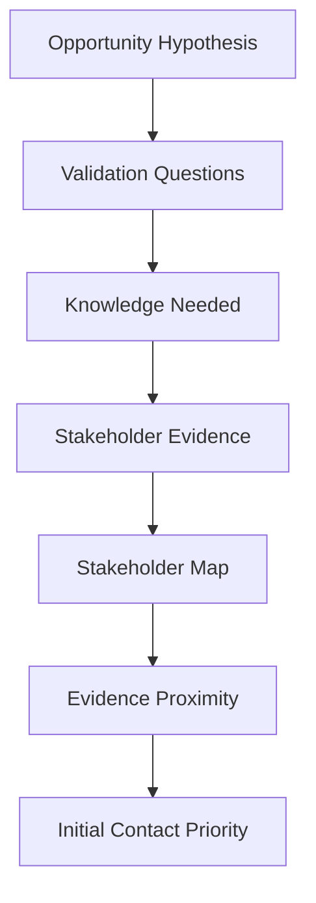

# Chapter 7 — Mapping the Buying Organization


## Purpose

Chapter 6 produced a provisional opportunity hypothesis. Chapter 7 asks: **Who inside the organization could help us confirm, refine, or refute the opportunity hypothesis?** It maps likely sources of evidence; it does not identify people to whom we should automatically sell.

The first question is not “Who can buy from us?” It is **“Who is closest to the evidence we need?”**



The progression is now **Account Research → Signals → Opportunity Hypothesis → Stakeholder Map → Contact Strategy → Conversation → Qualification**. This chapter ends at the stakeholder map. No contact strategy or outreach is executed.

## Learning objectives

After this chapter, you can:

1. Reuse a `Contact` while distinguishing a stakeholder from a buyer.
2. Retain public provenance for titles, responsibilities, roles, and relationships.
3. Map validation questions to deterministic knowledge domains and plausible evidence sources.
4. Evaluate question-specific evidence proximity without ranking a person globally.
5. Keep unsupported authority and organizational relationships explicitly `UNKNOWN`.
6. Evaluate domain coverage without demanding a complete buying committee.
7. Explain why evidence proximity, not seniority or purchase probability, determines initial validation priority.

## Stakeholder versus buyer

A `Contact` represents a person associated with an account. A `Stakeholder` composes that existing contact with evidence-backed claims relevant to this investigation. Neither record establishes buyer status.

```text
Job Title
≠
Authority

Stakeholder
≠
Buyer

First Contact
≠
Decision Maker
```

Likewise: executive ≠ best first contact; technical role ≠ technical decision-maker; manager ≠ budget owner; friendly person ≠ champion; interested person ≠ qualified sponsor; organizational influence ≠ formal authority; and access ≠ evidence. The model contains no buyer flag and makes purchasing, budget, procurement, and technical authority `UNKNOWN` unless direct evidence supports them.

## Knowledge domains

`KnowledgeDomain` expresses what someone might plausibly know: `WORKFLOW`, `TECHNOLOGY`, `BUSINESS_IMPACT`, `FINANCE`, `OPERATIONS`, `STRATEGY`, `PROCUREMENT`, `IMPLEMENTATION`, `CUSTOMER_EXPERIENCE`, and `MARKETING`. Domains are ordered scenario data, not predictions.

Maya Chen's supported operational-systems responsibilities connect her to workflow, technology, and operations. Marcus Lee's general-management responsibilities connect him to business impact, strategy, and operations. That does not imply that Maya has technical authority or Marcus knows detailed architecture.

## Evidence proximity

`EvidenceProximity` is `DIRECT`, `NEAR`, `INDIRECT`, or `UNKNOWN`. Every proximity record is tied to both a validation question and a knowledge domain. Someone can be direct for an event-workflow question and indirect or unknown for a finance question. The laboratory therefore never declares a globally “best stakeholder.”

## Organizational roles

Supported organizational-function hypotheses may use `WORKFLOW_OWNER`, `TECHNICAL_STAKEHOLDER`, `BUSINESS_STAKEHOLDER`, `ECONOMIC_STAKEHOLDER`, `PROCUREMENT_STAKEHOLDER`, `EXECUTIVE_SPONSOR`, `END_USER`, `INFLUENCER`, or `UNKNOWN`. A title alone does not justify one of these roles.

`CHAMPION` is intentionally absent. Champion status requires behavioral evidence: advocacy for change, help navigating the organization, or investment of political capital. A friendly response, interest, or title is insufficient.

## Stakeholder evidence

The scenario uses fixed fictional public sources: a company leadership page, job posting, conference biography, professional profile, organizational chart, and company website. `StakeholderEvidence` identifies a title, responsibility, organizational-role, or relationship claim and retains its source and source type. The stakeholder invariant rejects unsupported titles and responsibilities. There is no network access, LinkedIn scraping, or external API.

## Validation-question mapping

Chapter 6 questions can have several plausible sources:

- Reservation, event, and property coordination maps to Maya Chen, Daniel Brooks, and Sofia Ramirez.
- The reason for the Operations Systems Coordinator role maps to Daniel and Maya.
- Workflow effects draw complementary perspectives from Maya, Daniel, Sofia, and Marcus.
- The budget question maps to no known stakeholder and therefore remains `UNKNOWN`.

Multiple sources are alternatives and complementary perspectives—not recipients of automated outreach. “We do not yet know who owns this information” is a valid mapping result.

## Stakeholder graph

`StakeholderMap` retains the account, provisional hypothesis, stakeholders, question mappings, and graph edges. Known edges such as `OVERSEES` and `WORKS_WITH` require evidence identifiers. `UNKNOWN_RELATIONSHIP` must not carry invented support. The graph is intentionally incomplete; it never fills gaps merely to look like an organization chart.

## Information coverage

`StakeholderMapper.evaluate_coverage` evaluates knowledge domains, not contact count. In Blue Heron:

- Workflow: `COVERED`
- Technology: `COVERED`
- Business impact: `COVERED`
- Finance: `UNKNOWN`
- Procurement: `UNKNOWN`

This is `COVERAGE_READY`: enough plausible sources exist to begin learning, even though later-stage economic and purchasing-process knowledge remains absent. It does not mean the hypothesis is validated or the buying committee is known.

## Contact priority

Priority answers **“Who is the most appropriate person to approach first for the evidence currently needed?”** It never estimates likelihood of buying. Direct question proximity is weighted before near or indirect proximity; stable scenario order breaks ties. The output categories are `PRIMARY_VALIDATION_CONTACT`, `SECONDARY_VALIDATION_CONTACT`, `LATER_STAGE_CONTACT`, `INSUFFICIENT_RELEVANCE`, and `UNKNOWN`.

Maya is primary because her publicly described responsibilities are closest to the operational-systems questions. This does not make her a buyer, champion, budget owner, or decision-maker.

## Executive-first fallacy

Marcus is the most senior person in the map, yet the public record only places him near business-impact and strategy evidence and indirect to detailed coordination evidence. Maya is closer to workflow handoffs and systems coordination.

**The best first contact is often the person closest to the question, not the person highest on the organizational chart.**

Organizational seniority and evidence proximity are different dimensions.

## Multi-threading

One perspective can create blind spots. Over time, operations may describe workflow friction, technology may explain architecture, management may explain business impact, finance may explain economic constraints, and procurement may explain purchasing process. A sound understanding combines perspectives. Chapter 7 only maps them; it does not message anyone.

## Executable scenario and CLI usage

The deterministic Blue Heron scenario loads Chapter 6 candidate A and its original validation questions, adds five evidence-backed stakeholder views, constructs supported and unknown graph relationships, evaluates coverage, and prioritizes Maya for validation evidence.

```bash
python -m engagement_dev.cli chapter-7
```

The output explicitly shows `SUPPORTED_FOR_VALIDATION`, unknown authority, domain gaps, an evidence-oriented priority, and `OUTREACH SENT: No.`

## Debugger exercise

Select **Debug Chapter 7 Stakeholder Mapping** in VS Code and stop at the comment in `examples/debug_stakeholder_mapping.py`. Inspect:

- `hypothesis` and `validation_question`;
- `stakeholder` and `executive`;
- `knowledge_domains` and `question_proximity`;
- `supported_responsibilities` and `unknown_authority`; and
- `contact_priority`.

The breakpoint makes the comparison explicit: Maya is direct to the selected coordination question while Marcus is indirect, despite his senior title.

## Interpretation

A stakeholder map is an evidence-seeking plan, not a buying-committee claim. `COVERAGE_READY` means that an initial conversation could be informative. It does not mean a conversation has occurred, that outreach is warranted, or that the opportunity hypothesis has been confirmed.

## Common mistakes

- Searching for an executive before identifying the knowledge needed.
- Translating a title into budget, procurement, or technical authority.
- Labeling an accessible or friendly person a champion.
- Treating all proximity as a global person score.
- Counting contacts instead of evaluating domain coverage.
- Inventing reporting lines to complete the graph.
- Requiring finance and procurement contacts before any initial learning.
- Treating a first-contact priority as purchase probability or permission to send outreach.
- Treating Chapter 6's provisional hypothesis as a validated problem.

## Connection to Chapter 8

Chapter 8 — **Designing Evidence-Based Outreach** should ask: **How do we contact a relevant stakeholder without pretending we already understand their problem?** It should turn account research + observed signal + opportunity hypothesis + stakeholder relevance into a concise invitation to learn: “We noticed X. We work around Y. I am curious whether Z is actually an issue for you.” It should not claim, “We know you have X problem and we can fix it.” Chapter 8 is recommended next and is not implemented here.
