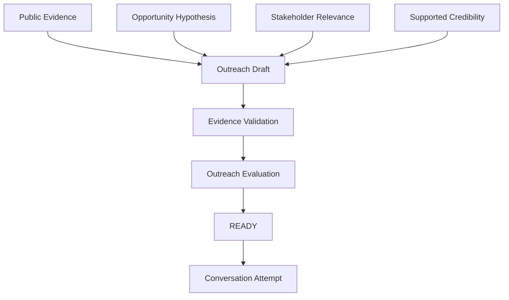

# Chapter 8 — Designing Evidence-Based Outreach


## Purpose

How do we contact a relevant stakeholder without pretending we already understand their problem? Chapter 8 turns the account research, provisional opportunity hypothesis, and stakeholder map into a respectful invitation to learn. It creates deterministic drafts and **never sends external communication**.

**Use evidence as context.**

**Use hypotheses as questions.**

## Learning objectives

After this chapter, you can trace factual outreach claims to public evidence, explain evidence-based personalization, support credibility with Chapter 1 proof, adapt one message to a channel, identify ethical violations, and distinguish a ready draft from sent outreach or qualification.

## Outreach objective and structure

The explicit objective is `VALIDATE_HYPOTHESIS`: seek a conversation that may confirm, refine, or refute the internal hypothesis. A useful draft answers why this organization, person, topic, and conversation are reasonable:

**OBSERVATION → RELEVANCE → CREDIBILITY → QUESTION → LOW-FRICTION NEXT STEP**

- **Observation:** public, relevant, evidence-linked context.
- **Relevance:** why this stakeholder is plausibly close to the question.
- **Credibility:** a bounded statement supported by Chapter 1 proof.
- **Question:** the hypothesis in provisional, neutral form.
- **Call to action:** a short conversation, not commitment.



## Evidence traceability

Every factual organization claim is represented by `OutreachEvidence` and cites account-evidence identifiers. “Fourth property announced” cites the public expansion evidence; the posted coordinator role cites the public job-posting evidence. Missing or unknown identifiers produce `UNSUPPORTED_CLAIM`. Internal assumptions never qualify as evidence.

## Public evidence versus internal hypothesis

Public observations may be stated as context. “Expansion may be increasing coordination requirements” is an internal inference, so the draft asks how Maya approaches coordination; it never declares that expansion causes problems. Outreach tests the hypothesis and does not validate it.

## Personalization

Meaningful personalization is **evidence-based relevance**. “Hi Maya, I love what Blue Heron Resort is doing!” is weak: a name and generic compliment do not explain selection. “I saw another property was announced, and your publicly described role focuses on operational systems coordination” is stronger because both organization and recipient relevance are inspectable. Never simulate familiarity or use unrelated personal details.

## Credibility

Northstar says it investigates workflow and systems-integration problems in multi-system operations. The statement is grounded in Chapter 1's fictional educational proof artifacts. It does not invent customers, revenue, case studies, certifications, partnerships, or quantified outcomes. Proof of capability still does not prove customer need.

## Calls to action

At this stage the goal is **conversation**, not commitment. “Would you be open to a short conversation?” or “Would comparing notes for 20 minutes be useful?” is appropriate. Demo, proposal, start-date, and budget-control requests produce `CTA_TOO_AGGRESSIVE`.

## Channel adaptation

`EMAIL` allows the complete five-part structure. `PROFESSIONAL_NETWORK` deterministically removes some context and stays concise. `PHONE_PREPARATION` and `IN_PERSON_PREPARATION` are preparation formats, not integrations. The laboratory has no email, professional-network, SMS, dialer, or other delivery client.

## Evaluation rules

The ordered evaluator uses categorical outcomes rather than an arbitrary score: `SUPPORTED`, `UNSUPPORTED_CLAIM`, `REJECTED_ASSUMPTIONS`, `INSUFFICIENT_RELEVANCE`, `SOLUTION_PREMATURE`, `TOO_BROAD`, and `CTA_TOO_AGGRESSIVE`. It checks evidence references, supported stakeholder proximity, hypothesis discipline, Chapter 1 proof, question form, CTA friction, channel length, and focus.

## Ethical boundaries

Professional outreach prohibits deceptive familiarity, invented referrals, fake urgency or scarcity, misleading subjects, fabricated social proof, pretending to be a customer, hiding commercial intent when relevant, repeated harassment, and exploiting personal information unrelated to the business question. A response or lack of response never licenses pressure.

## Executable scenario and CLI

Blue Heron Resort, Maya Chen, and the Chapter 6 hypothesis continue unchanged. Candidate A is evidence-led; B asserts assumptions; C is generic; D overloads the channel; and E prescribes an API. The supported candidate reaches `READY`, while `ACTUAL MESSAGE SENT` remains `No`.

```bash
python -m engagement_dev.cli chapter-8
```

## Debugger exercise

Select **Debug Chapter 8 Outreach Evaluation**. Break at the marked line and inspect account evidence, stakeholder question proximity, hypothesis, factual claims and evidence references, credibility proof IDs, CTA, and evaluator result. Compare Candidate A with Candidate B to see why public context passes while an internal inference stated as fact fails.

## Interpretation

`READY` means the deterministic draft passed the educational rules. It does not mean sent, replied, validated, qualified, approved, or forecastable.

```text
Outreach ≠ Pitch
Reply ≠ Qualification
Meeting ≠ Opportunity
```

## Common mistakes

- Converting “may” into “is,” or treating a job posting as proof of pain.
- Personalizing with compliments rather than business relevance.
- Inventing authority, urgency, budget, proof, outcomes, or referrals.
- Leading with software, APIs, automation, demos, or proposals.
- Including every research fact and capability.
- Treating `READY` as permission, delivery, response, or qualification.

## Connection to Chapter 9

Chapter 9 — **Running the First Conversation** should ask: **If someone responds, how do we conduct the first conversation so that we learn rather than immediately pitch?** It should simulate opening, context, neutral questions, listening, evidence capture, hypothesis strengthening/refinement/refutation, and an appropriate next step. `MORE_EVIDENCE_NEEDED` and `NO_CURRENT_OPPORTUNITY` must remain successful discovery outcomes. Chapter 9 is not implemented.
