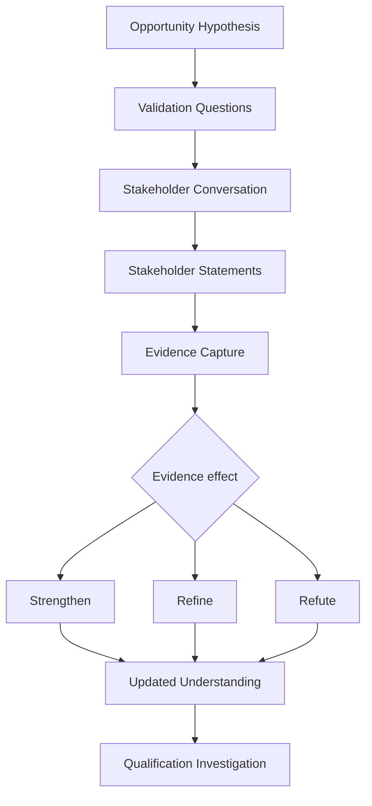

# Chapter 9 — Running the First Conversation


## Purpose

If a relevant stakeholder responds, how do we conduct the first conversation so that we learn rather than immediately pitch? The explicit objective is `VALIDATE_OPPORTUNITY_HYPOTHESIS`, and its purpose is to **reduce uncertainty**. No external communication occurs; the transcript is a deterministic educational simulation.

> Conversation ≠ Pitch  
> Stakeholder Statement ≠ Automatic Objective Truth  
> Confirmed Manual Work ≠ Confirmed Business Problem  
> Problem Evidence ≠ Solution Decision

**The purpose of discovery is to become less wrong.** Finding no current opportunity is successful discovery.

## Learning objectives

After this chapter, you can conduct a neutral first conversation; follow disclosed evidence instead of a questionnaire; preserve direct statements and separate interpretations; strengthen, refine, refute, or defer a hypothesis; maintain an evidence ledger; and stop before qualification or solution selection.

## First-conversation objective

`VALIDATE_OPPORTUNITY_HYPOTHESIS` focuses the conversation on learning enough to strengthen, refine, refute, or defer the hypothesis. It is not a mandate to demo, pitch, obtain commitment, manufacture urgency, force budget discovery, or advance an account regardless of evidence.

## Conversation structure

**OPEN → CONTEXT → EXPLORE → CLARIFY → SUMMARIZE → NEXT STEP**

- **OPEN:** establish why the conversation is happening.
- **CONTEXT:** briefly name the public observation; do not give a company monologue.
- **EXPLORE:** ask neutral questions about the present workflow and change.
- **CLARIFY:** follow significant statements.
- **SUMMARIZE:** reflect what was heard without upgrading it to universal truth.
- **NEXT STEP:** choose an evidence-appropriate action, including no action.

## Question types and neutral questions

`CURRENT_STATE`, `CHANGE`, `WORKFLOW`, `IMPACT`, `TECHNOLOGY`, `STAKEHOLDER`, `PRIORITY`, `HISTORY`, `CONSTRAINT`, and `NEXT_STEP` describe what the learner is trying to understand. They are not a rigid script.

Ask “How are reservations and event workflows coordinated today?”, “What parts work particularly well?”, and “Where, if anywhere, does coordination become difficult?” Do not ask “How bad are your integration problems?” or “Who has the budget to fix this?” Those questions assume pain or a buying process that evidence has not established. `ConversationEvaluator` flags such conversations as `ASSUMPTION_LED`.

## Listening versus interrogation

When Maya says event bookings use a separate workflow, the simulator asks what information moves between that workflow and property operations. When she mentions manual transfer, it asks which details move manually. It does not jump to an unrelated budget question.

**Follow evidence, not the script.**

## Stakeholder statements as evidence

Chapter 9 introduces direct `STAKEHOLDER_STATEMENT` evidence. `StakeholderStatement` retains the stakeholder, exact statement, topic, relationship to the hypothesis, and source conversation. It records **“Maya stated Y,”** not “Y is timeless objective truth.” `ConversationEvidence` keeps that statement separate from an analyst interpretation, and business impact remains unknown until established.

Direct internal evidence is generally more relevant to current internal operations than an older unsupported public inference. It may therefore weaken that inference without erasing the public record.

## Hypothesis strengthening, refinement, and refutation

- `HYPOTHESIS_STRENGTHENED` means direct evidence supports the original scope.
- `HYPOTHESIS_REFINED` means evidence supports a narrower or materially changed explanation.
- `HYPOTHESIS_REFUTED` means direct evidence defeats the explanation.
- `MORE_EVIDENCE_NEEDED` defers judgment.
- `NO_CURRENT_OPPORTUNITY` is a legitimate next state.

Blue Heron's original hypothesis is that expansion may increase coordination requirements across reservation, event, and property operations. Maya states that reservations are centralized, the new property uses the same platform, and expansion is not creating major reservation issues. She also states that event booking remains separate and coordinators manually transfer some banquet details. The preserved revision history is:

**ORIGINAL HYPOTHESIS → STAKEHOLDER EVIDENCE → REFINED HYPOTHESIS**

The refined hypothesis is: **“Event-booking information may require repeated manual transfer into property operational workflows.”** It does not overwrite the original.

In the secondary scenario, Maya states that systems are unified, expansion does not change the workflow, and no coordination issues are occurring. The result is `HYPOTHESIS_REFUTED` and `NO_CURRENT_OPPORTUNITY`. This is successful learning because it prevents unsupported pursuit.

## New information

A stakeholder may introduce an unrelated issue, such as event-deposit reconciliation. Record it as `INTRODUCES_NEW_INFORMATION`; do not automatically turn it into an opportunity. It may justify a separate future hypothesis after appropriate evidence review.

## Evidence ledger and unresolved unknowns

The inspectable ledger contrasts what changed:

| Before | After |
|---|---|
| Known publicly: expansion, systems hiring, platform change | Known as statements: reservations centralized, event booking separate, some event details manually transferred |
| Hypothesized: operational coordination complexity | Refined: possible event-information transfer issue |
| Unknown: actual workflow, friction, impact | Still unknown: volume, frequency, error rate, labor cost, impact, priority, ownership, desired change, intervention, budget, decision process |

Discovery adds knowledge without hiding what remains unknown. Conversation completion does not create qualification.

## Avoiding premature solutions

Manual work alone does not select an integration. Possible later responses include process change, configuration, an existing feature, training, accepting the current process, integration, or no action. Chapter 9 selects none. Impact, priority, desired future state, and constraints must be investigated first.

## Evidence flow



## Executable scenario and CLI usage

```bash
python -m engagement_dev.cli chapter-9
```

The report displays the Blue Heron transcript, evidence effects, original and refined hypotheses, evidence ledger, unknowns, no qualification, no selected solution, and a smaller refutation scenario.

## Debugger exercise

Select **Debug Chapter 9 First Conversation** in VS Code. Stop at the marked line in `examples/debug_first_conversation.py`. Inspect `current_hypothesis`, `question`, `stakeholder_statement`, `statement_relationship`, `evidence_ledger`, `follow_up_question`, `hypothesis_outcome`, and `unresolved_unknowns`. The breakpoint sits where direct stakeholder evidence changes the current interpretation.

## Interpretation

The primary conversation supports a narrower question, not a formal opportunity. The expansion-wide inference weakened; the event-workflow hypothesis became more specific and traceable. Frequency, impact, priority, ownership, timing, budget, decision process, and the appropriateness of technology remain unknown.

## Common mistakes

- Pitching or demonstrating before learning the current state.
- Asking questions that assume pain, cost, urgency, authority, or budget.
- Running a fixed questionnaire instead of following evidence.
- Paraphrasing a stakeholder statement into stronger objective language.
- Treating manual work as waste, impact, or an integration requirement.
- Overwriting the original hypothesis during refinement.
- Treating refutation as failure or inventing another opportunity immediately.
- Calling a completed conversation qualified.

## Connection to Chapter 10

Chapter 10 — **Qualifying the Opportunity** should ask: **We now have evidence that a real problem may exist—but is it important and actionable enough to justify a formal sales engineering engagement?** It should investigate problem, impact, priority, ownership, timing, current approach, constraints, decision process, and willingness to consider external help. It should allow evidence-driven outcomes including more discovery, no actionable impact, no owner, inactive timing, not a fit, or no current opportunity—never a fake probability score. Chapter 10 is not implemented.
