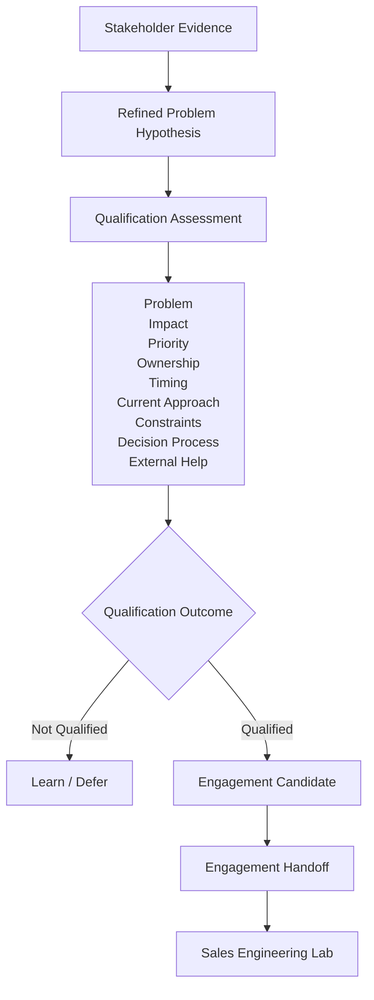

# Chapter 10 — Qualifying the Opportunity


## Purpose

Chapter 10 asks: **We now have evidence that a real problem may exist—but is it important and actionable enough to justify a formal sales engineering engagement?** It is the carefully controlled boundary between engagement development and formal Sales Engineering. A problem existing does not automatically mean an engagement exists.

> **Qualification is permission to investigate more deeply, not permission to assume the answer.**

Problem **≠** Qualified Opportunity  
Qualified Opportunity **≠** Closed Deal  
Engagement Candidate **≠** Solution

## Learning objectives

After this chapter, you can:

- distinguish problem, impact, priority, ownership, timing, budget, authority, and decision process;
- make every qualification conclusion cite evidence and leave absent facts unknown;
- apply a conservative, deterministic threshold without a lead score or probability;
- create an `EngagementCandidate` only from `QUALIFIED_FOR_ENGAGEMENT`;
- preserve reassessments and prepare a solution-neutral `EngagementHandoff`.

## Qualification versus discovery

Discovery learns what is true. Qualification decides whether what is known justifies structured effort. Qualification is not a one-time checkbox: evidence can change. An assessment may be `QUALIFIED_FOR_ENGAGEMENT` today and, after a postponement, `TIMING_NOT_ACTIVE`. The scenario retains both immutable assessments rather than deleting history.

These distinctions remain essential:

- Problem ≠ Priority; Priority ≠ Project; Project ≠ External Engagement.
- Interest ≠ Commitment; Urgency ≠ Budget; Budget ≠ Authority.
- Authority ≠ Decision Process; Technical Fit ≠ Business Fit.
- Good Conversation ≠ Qualified Opportunity.

## Qualification dimensions and evidence requirements

Every non-unknown dimension state requires one or more evidence identifiers. Unknown states can—and should—have no fabricated support.

| Dimension | Explicit states used by the model | Question |
|---|---|---|
| Problem | `CONFIRMED`, `PARTIAL`, `UNKNOWN`, `REFUTED` | Does customer-grounded evidence establish a specific problem? |
| Impact | `CONFIRMED`, `PARTIAL`, `UNKNOWN`, `NO_ACTIONABLE_IMPACT` | Are there meaningful consequences such as labor, delay, errors, friction, risk, lost capacity, inability to scale, or overhead? |
| Priority | `ACTIVE`, `EMERGING`, `LOW`, `UNKNOWN`, `NOT_A_PRIORITY` | Does the organization care enough to investigate now? |
| Ownership | `IDENTIFIED`, `PARTIAL`, `UNKNOWN` | Is someone responsible for the workflow or outcome? Ownership is not budget authority. |
| Timing | `ACTIVE`, `UPCOMING`, `UNDEFINED`, `DEFERRED` | Is there a meaningful investigation horizon? |
| Current approach | `KNOWN`, `PARTIAL`, `UNKNOWN` | Is the present manual process, software, workaround, internal build, vendor, or accepted cost understood? It may be adequate. |
| Constraints | `KNOWN`, `PARTIAL`, `UNKNOWN` | What evidenced staffing, integration, policy, budget, procurement, security, capacity, or change limits apply? |
| Decision process | `KNOWN`, `PARTIAL`, `UNKNOWN` | How would investigation or change proceed? |
| Provider fit | `SUPPORTED`, `UNKNOWN`, `NOT_A_FIT` | Does the supported offer overlap the problem? |
| External help | `OPEN`, `POSSIBLY_OPEN`, `UNKNOWN`, `INTERNAL_ONLY`, `NOT_INTERESTED` | Would the organization consider external assistance? |
| Agreed investigation | `KNOWN`, `PARTIAL`, `UNKNOWN` | Is there an agreed reason for deeper structured investigation? |
| Budget | `KNOWN`, `PARTIAL`, `UNKNOWN` | What has actually been established? Never infer budget. |

Impact may be operational without being monetary. Blue Heron's repeated staff effort and correction work are meaningful, but financial impact remains unknown because no stakeholder quantified it. Constraints likewise require evidence rather than imagination.

## Qualification outcomes

The explainable outcomes are `QUALIFIED_FOR_ENGAGEMENT`, `MORE_DISCOVERY_NEEDED`, `NOT_CURRENT_PRIORITY`, `NO_ACTIONABLE_IMPACT`, `NO_CLEAR_OWNER`, `TIMING_NOT_ACTIVE`, `EXTERNAL_HELP_NOT_ACCEPTED`, `NOT_A_FIT`, and `NO_CURRENT_OPPORTUNITY`. There is no numeric lead score, close probability, or invented contract value.

## Conservative qualification threshold

`QUALIFIED_FOR_ENGAGEMENT` requires evidence for all of the following:

1. a specific, confirmed problem;
2. meaningful, confirmed impact;
3. active or emerging organizational priority;
4. an identified relevant owner;
5. active or upcoming timing;
6. supported overlap with the provider's bounded offer;
7. external help that is open or plausibly open; and
8. an agreed reason for structured investigation.

Budget **does not need to be established** before initial Sales Engineering investigation, but it cannot be assumed. `BUDGET: UNKNOWN` remains explicit. A partial decision process also remains an engagement question rather than automatically blocking the initial investigation.

## Blue Heron qualification matrix

```text
QUALIFICATION ASSESSMENT
Problem             CONFIRMED
Impact              CONFIRMED
Priority            ACTIVE
Ownership           IDENTIFIED
Timing              UPCOMING
Current approach    KNOWN
Constraints         PARTIAL
Decision process    PARTIAL
External help       POSSIBLY_OPEN
Budget              UNKNOWN

OVERALL
QUALIFIED_FOR_ENGAGEMENT
```

Maya's direct statements establish repeated event-detail transfer, staff effort, and occasional mismatches requiring correction. Daniel Brooks, Director of Operations, identifies the active initiative, owns it, wants investigation before fourth-property event operations, can sponsor an investigation subject to technology review, and says external technical assistance could be considered. The centralized reservation platform must remain. Exact budget, final technical approver, procurement, architecture, solution, and implementation scope remain unknown.

## Engagement candidate

Only a qualifying assessment can create `EngagementCandidate`. It holds the account, refined hypothesis, assessment, stakeholder evidence, known stakeholders, impact evidence, current approach, evidenced constraints, timing, unresolved questions, investigation objective, and handoff status. It contains no guaranteed deal, probability, value, assumed solution, or assumed architecture. It means only: **enough justified evidence exists to begin a structured Sales Engineering engagement**.

## Reassessment

The executable scenario stores an assessment history. Its first entry qualifies; its second records a later `DEFERRED` timing state and produces `TIMING_NOT_ACTIVE`. Historical evidence is not rewritten to make the current state look inevitable.

## Handoff package

`EngagementHandoff` is this textbook's output and the downstream laboratory's input:

- **Account:** Blue Heron Resort
- **Problem:** event-booking information requires repeated manual transfer into property operational workflows.
- **Evidence:** retained stakeholder statements and identifiers.
- **Business impact:** repeated staff effort and occasional correction work.
- **Priority:** active operational improvement initiative.
- **Owner:** Daniel Brooks, Director of Operations.
- **Timing:** investigate before fourth-property event operations begin.
- **Current approach:** manual transfer plus review.
- **Known constraint:** centralized reservation platform remains in place.
- **External help:** potentially acceptable.
- **Unknowns:** budget, detailed architecture, final technical approver, procurement process, solution options, and implementation scope.
- **Engagement objective:** determine whether a practical change to the event-information workflow can reduce repeated manual transfer while respecting existing platform constraints.

The objective describes what needs investigation; it does not prescribe a solution.

## Boundary with the downstream Sales Engineering Laboratory

This repository ends when **enough customer-grounded evidence exists to justify structured sales engineering investigation**. The downstream Sales Engineering Laboratory begins with **a qualified engagement candidate and an evidence-backed handoff package**. No downstream discovery, requirements, architecture, demonstration, recommendation, proposal, or measurement behavior is implemented here.

```text
Engagement Development Laboratory
Market → Account → Signal → Hypothesis → Stakeholder → Conversation → Qualification → Engagement Candidate
                                      HANDOFF
                                         ↓
Sales Engineering Laboratory
Engagement → Discovery → Requirements → Capabilities → Gaps → Architecture → Demonstration → Recommendation → Proposal → Measurement
```



## Executable scenarios

- **A — Blue Heron:** passes the threshold and creates a candidate and handoff.
- **B — Real problem, low priority:** `NOT_CURRENT_PRIORITY`; no candidate.
- **C — Problem and priority, internal-only:** `EXTERNAL_HELP_NOT_ACCEPTED`; no candidate.
- **D — Interesting symptoms, insufficient impact:** `MORE_DISCOVERY_NEEDED`; no candidate.
- **E — Refuted hypothesis:** `NO_CURRENT_OPPORTUNITY`; no candidate.

Qualification is selective; learning, deferring, or stopping is valid.

## CLI usage

```bash
python -m engagement_dev.cli chapter-10
```

The deterministic report prints the refined hypothesis, evidence for each visible dimension, explicit unknown budget, overall result, candidate boundary statements, handoff readiness, and next step.

## Debugger exercise

Launch **Debug Chapter 10 Qualification** in VS Code. Set breakpoints after `analyze_chapter_ten()` and inspect `refined_hypothesis`, `qualification_dimensions`, `supporting_evidence`, `unresolved_gaps`, `threshold_evaluation`, and `engagement_candidate_creation_decision`. Compare the qualified result with `insufficient_impact`: missing impact blocks qualification while exact budget can remain unknown.

## Interpretation

Qualification converts a body of evidence into an auditable allocation decision. It does not turn statements into certainty, sponsorship into final authority, timing into budget, or provider fit into a designed solution.

## Common mistakes

- Treating a confirmed problem, pleasant conversation, urgency, or owner as sufficient alone.
- Inventing money, constraints, authority, procurement, or architecture.
- Treating internal-only work as an external engagement.
- Using a score that hides which threshold failed.
- Deleting an older assessment after circumstances change.
- Writing an engagement objective that secretly selects a product or architecture.

## Connection to Chapter 11

Chapter 11 should be **Managing Follow-Up Without Chasing**. It should return to non-response, “not now,” requested later follow-up, and conversations that go quiet. It should teach `NO RESPONSE ≠ REJECTION`, `NOT NOW ≠ NEVER`, `INTEREST ≠ COMMITMENT`, and `FOLLOW-UP ≠ HARASSMENT`, with respectful evidence-based follow-up and explicit stopping rules. Chapter 11 is not implemented here.
