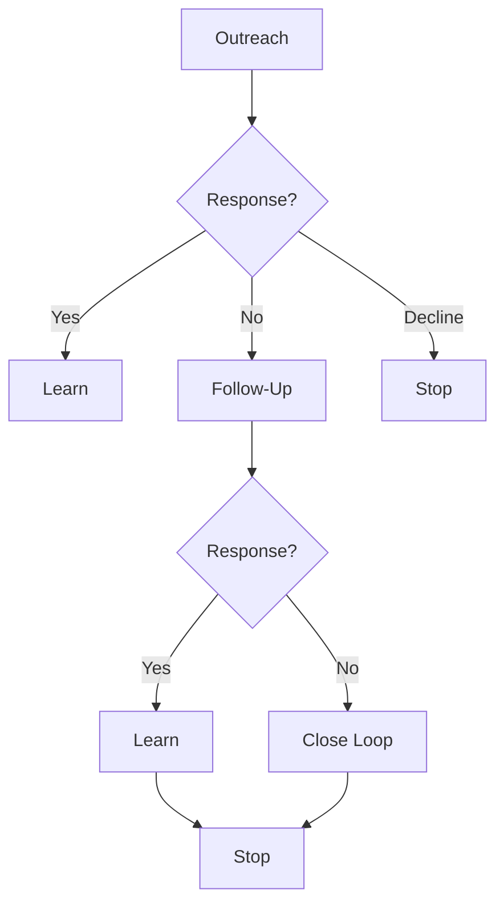

# Chapter 11 — Managing Follow-Up Without Chasing


## Purpose

**Central question:** What should we do when outreach or a promising conversation does not immediately lead to the next step?

Follow-up is an evidence-driven continuation of engagement development. It exists because there is a legitimate unresolved reason to reconnect—not simply because **we want a response**. This chapter uses simulated communication only.

## Learning objectives

By the end of this chapter, you can:

- keep silence epistemically neutral;
- identify and preserve a legitimate follow-up reason;
- respect a stakeholder's requested date or event;
- apply conservative, deterministic timing and stopping rules;
- distinguish a new evidence context from continued chasing;
- close a sequence without guilt or pressure; and
- preserve referral provenance without inventing recipient interest.

## The evidence boundary

No Response
≠
Rejection

No Response
≠
Interest

Not Now
≠
Never

Follow-Up
≠
Chasing

Likewise, **interest ≠ commitment**, **silence ≠ hidden interest**, **follow-up ≠ pressure**, and **persistence ≠ harassment**. A lack of response establishes only: **No response has been observed.**

> **The absence of a response is not permission to invent a reason for the silence.**



## Follow-up reasons

Every `FollowUpAction` has an explicit reason:

- `NO_RESPONSE_TO_INITIAL_OUTREACH`
- `REQUESTED_FOLLOW_UP`
- `TIMING_CHANGE`
- `NEW_RELEVANT_EVIDENCE`
- `OPEN_QUESTION`
- `POST_CONVERSATION_NEXT_STEP`
- `QUALIFICATION_GAP`
- `STAKEHOLDER_REFERRAL`

The action also retains its account, stakeholder, prior `OutreachAttempt` or `Conversation`, evidence/context, proposed message, intended timing, status, attempt count, and stopping-rule state. Missing reasons are rejected. Nothing in the model can deliver a real message.

## Timing is contextual

There is no universal optimal cadence. The executable scenario uses fixed dates so learners can inspect repeatable behavior:

| Scenario day | Observed state or action |
|---|---|
| Day 0 | Initial evidence-based outreach is `SENT_SIMULATED`. |
| Day 5 | No response is observed. |
| Day 7 | One concise follow-up is supported. |
| Day 14 | No response is observed again. |
| Day 18 | The optional close-the-loop message is evaluated and the sequence closes. |

These are **educational scenario defaults**, not a universal best practice. Fake urgency is never evidence. An explicit “send me something next week” is followed next week; “contact me next quarter” is respected until then.

## Requested follow-up

Daniel Brooks says: “Reach back out once the fourth property starts event operations.” The request is stored as `REQUESTED_FOLLOW_UP` with the named event. Before the event is observed, evaluation returns `DEFER_UNTIL_REQUESTED_TIME`. On the deterministic event date, after the event is observed, it returns `SUPPORTED`. The proposed message truthfully references Daniel's earlier request.

Requested follow-up is stronger evidence than an arbitrary desire to persist. It still does not establish commitment.

## No-response handling

The policy deliberately permits only a small sequence:

```text
INITIAL OUTREACH
→ NO RESPONSE
→ ONE EVIDENCE-BASED FOLLOW-UP
→ NO RESPONSE
→ OPTIONAL FINAL CLOSE-THE-LOOP MESSAGE
→ STOP
```

No conversation is created, qualification does not change, and no `EngagementCandidate` is created. Blue Heron may remain available for later evidence-based reassessment, but the current outreach sequence is closed.

## Stopping rules

`StoppingRuleState` records whether a sequence is stopped and why. Reasons include:

- `MAX_ATTEMPTS_REACHED`
- `EXPLICIT_DECLINE`
- `NO_LONGER_RELEVANT`
- `HYPOTHESIS_REFUTED`
- `REQUESTED_NO_CONTACT`
- `TIMING_TOO_DISTANT`
- `ACCOUNT_OUT_OF_SCOPE`

The educational `FollowUpPolicy` permits two follow-up actions: one concise follow-up and one optional close-the-loop action. A stopped sequence does not restart automatically. New public evidence can establish a genuinely new context; the evidence identifiers must make that different from continuing to chase.

## Explicit decline and no-contact

“We are handling this internally and aren't looking for outside help” is recorded as `EXTERNAL_HELP_NOT_ACCEPTED`; the current sequence closes with `EXPLICIT_DECLINE`.

“Please remove me from future outreach” is recorded as `REQUESTED_NO_CONTACT`. This is a strict contact-level stop: no later follow-up to that person may be generated, including after a long interval.

## “Not now” is not one state

- “We're interested, but contact us after the property opens” supplies `REQUESTED_FOLLOW_UP` evidence.
- “We don't have bandwidth this year” can produce `DEFERRED`; it does not prove future intent.
- “This is not a priority for us” can inform qualification as `NOT_CURRENT_PRIORITY`.

Preserve the actual stakeholder statement and its conversation provenance. Do not translate every delay into optimism.

## New evidence

After earlier silence, a public announcement that Blue Heron's fourth property has opened and is hiring event-operations staff creates `NEW_RELEVANT_EVIDENCE`. A legitimate message can say:

> I noticed the new property has now opened. When I reached out earlier I was curious about coordination across event operations as the organization expanded. Has that changed at all now that the new location is live?

This message names the changed context and asks one question. It is different from “Just bumping this again,” which the evaluator rejects.

## Message quality and close-the-loop messages

A follow-up is normally shorter than initial outreach. It preserves context, states the reason for reconnecting, asks one focused question, makes decline or deferral easy, and avoids guilt. The evaluator flags phrases such as “I've emailed several times and haven't heard back,” “I know you're busy,” “Just checking whether you saw my previous messages,” and “Can you please respond?” as `PRESSURE_LANGUAGE`.

The optional final message simply ends the current sequence:

> I'll close the loop here. If workflow coordination becomes relevant as the new property ramps up, I'd be happy to compare notes.

Afterward the action is `CLOSED`; it is not a psychological technique to prompt a reply.

## Referrals

Daniel says: “This isn't my area. You should talk to Sofia Ramirez in Events.” The system records `STAKEHOLDER_REFERRAL`, the source statement, source conversation, referring stakeholder, and a possible contact path to Sofia. It does **not** mark Sofia as interested. A later action may prepare evidence-based outreach that references Daniel's referral truthfully.

## Follow-up evaluator

`FollowUpEvaluator` uses ordered rules rather than an engagement score. Its explainable outcomes are `SUPPORTED`, `TOO_SOON`, `NO_VALID_REASON`, `TOO_MANY_ATTEMPTS`, `CONTRADICTS_STAKEHOLDER_REQUEST`, `PRESSURE_LANGUAGE`, `CLOSE_SEQUENCE`, and `DEFER_UNTIL_REQUESTED_TIME`.

The evaluator checks a strong stop first, then reason, language, attempt count, requested timing, general timing, and the close-loop boundary. Desire, optimism, and hidden-intent guesses are absent.

## Executable scenarios and CLI usage

Run:

```bash
python -m engagement_dev.cli chapter-11
```

The deterministic report demonstrates no response, requested follow-up, explicit decline, referral, no-contact, and new-evidence branches. Every sent state is simulated and the report confirms that no external message was sent.

## Debugger exercise

Choose **Debug Chapter 11 Follow-Up Policy** in VS Code. Set a breakpoint after each evaluation in `examples/debug_follow_up_policy.py`. Inspect:

- `previous_outreach`
- `response_state`
- `follow_up_reason`
- `elapsed_deterministic_time`
- `stakeholder_request`
- `attempt_count`
- `stopping_rule`
- `evaluator_result`

The first evaluation is allowed. The later attempt exceeds the policy and is blocked. Change only one input at a time and explain which rule changes the result.

## Interpretation

The primary scenario ends with **NO CURRENT CONVERSATION**, **NO QUALIFICATION CHANGE**, and **OUTREACH SEQUENCE CLOSED**. That result is useful: the system knows what was and was not observed, avoids manufacturing pipeline progress, and releases attention for other evidence-backed work.

## Ethical boundaries

- Never infer emotion, intent, rejection, or interest from silence.
- Never evade a decline or contact-level no-contact request.
- Never manufacture urgency or use guilt.
- Never restart a stopped sequence merely because time passed.
- Never treat a referral as permission to claim interest.
- Never send external communication from this laboratory.

## Common mistakes

1. Using “wanting a response” as the follow-up reason.
2. Treating silence as either rejection or hidden interest.
3. Treating “not now” as a promise.
4. Ignoring a requested date or event.
5. Calling repeated “checking in” evidence-based persistence.
6. Restarting a closed sequence without genuinely new evidence.
7. Allowing activity to change qualification or create an engagement candidate.

## Connection to Chapter 12

Continue with **Chapter 12 — Building and Managing the Engagement Pipeline**. Its central question is: **How do we manage many accounts at different evidence states without confusing activity with real progress?** It combines accounts across `RESEARCHING`, `SIGNAL_FOUND`, `HYPOTHESIS_SUPPORTED`, `OUTREACH_READY`, `AWAITING_RESPONSE`, `CONVERSATION_ACTIVE`, `MORE_DISCOVERY_NEEDED`, `DEFERRED`, `QUALIFIED_FOR_ENGAGEMENT`, and `CLOSED_NO_OPPORTUNITY`, and introduces capacity management so one silent account cannot consume all available attention.
