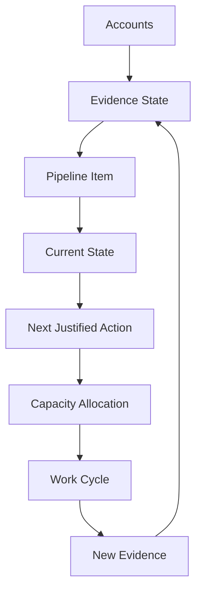

# Chapter 12 — Building and Managing the Engagement Pipeline


## Purpose

How do we manage many accounts at different evidence states without confusing activity with actual progress? Chapter 12 composes the records built in Chapters 0–11 into a portfolio projection:

**Market → Account → Research → Signal → Hypothesis → Stakeholder → Outreach → Conversation → Qualification → Engagement Candidate**

Pipeline state answers **“What evidence do we currently have?”**, not “How much do we want this account to become a deal?” A pipeline should make uncertainty visible.

> **The purpose of a pipeline is to make reality easier to see, not to make the future look larger.**

## Learning objectives

After this chapter, you can:

1. Derive a portfolio state from existing lifecycle evidence.
2. Distinguish activity from evidence movement and an account from an opportunity.
3. Preserve transition history while allowing regression and closure.
4. Select the next justified action without inventing arbitrary “touches.”
5. Allocate limited work capacity and enforce simple work-in-progress limits.
6. Identify silent and stale accounts without manufacturing rejection.
7. Explain pipeline health through findings rather than scores or financial forecasts.

## The evidence-based pipeline



These distinctions are constraints, not slogans:

- **ACTIVITY ≠ PROGRESS**
- **ACCOUNT ≠ OPPORTUNITY**
- **OUTREACH SENT ≠ ENGAGEMENT CREATED**
- **REPLY ≠ QUALIFICATION**
- **MEETING ≠ BUYING INTENT**
- **PIPELINE VALUE ≠ REVENUE**
- **BUSY ≠ EFFECTIVE**
- **Pipeline State ≠ Optimism**
- **Meeting Count ≠ Opportunity Quality**

## Evidence-based pipeline states

| State | Evidence meaning |
|---|---|
| `RESEARCHING` | Account-level research remains underway. |
| `SIGNAL_FOUND` | At least one supported direct signal exists. |
| `HYPOTHESIS_SUPPORTED` | An existing `OpportunityHypothesis` is supported for validation. |
| `STAKEHOLDER_MAPPED` | An existing `StakeholderMap` identifies relevant evidence sources. |
| `OUTREACH_READY` | An existing `OutreachAttempt` is reviewed and ready, but not sent. |
| `AWAITING_RESPONSE` | Simulated outreach is sent or records no response; no conversation evidence exists. |
| `CONVERSATION_ACTIVE` | A stakeholder conversation is planned or a reply requires conversation. |
| `MORE_DISCOVERY_NEEDED` | Conversation or qualification evidence exists, but the threshold is incomplete. |
| `DEFERRED` | Evidence documents a timing, trigger, or capacity reason to revisit later. |
| `QUALIFIED_FOR_ENGAGEMENT` | A passing Chapter 10 assessment and matching `EngagementCandidate` both exist. |
| `CLOSED_NO_OPPORTUNITY` | Evidence ends this investigation without an engagement. |
| `OUT_OF_SCOPE` | Evidence maps the work to a provider boundary or unsupported fit. |

There are no `HOT`, `WARM`, or `COLD` labels. Those labels express sentiment rather than evidence.

## Pipeline items and derived state

`PipelineItem` references the existing account research, signal, hypothesis, stakeholder, outreach, conversation, qualification, engagement-candidate, and follow-up records. It also records blockers, unresolved questions, the last meaningful evidence event, activities, and history. It has no assignable `stage` field.

`derive_pipeline_state` applies ordered rules. Explicit evidence-backed dispositions take precedence. A refuted hypothesis closes the current investigation. A passing assessment alone is insufficient: the matching engagement candidate must exist. Otherwise qualification means more discovery, a completed non-refuting conversation means more discovery, a simulated send means awaiting response, and progressively earlier evidence produces the earlier states.

This makes the pipeline a **projection**, not a second source of truth. Adding a note cannot promote an item. Replacing a state label is impossible because no mutable state label exists.

## State transitions and history

The allowed forward path is explicit:

`RESEARCHING → SIGNAL_FOUND → HYPOTHESIS_SUPPORTED → STAKEHOLDER_MAPPED → OUTREACH_READY → AWAITING_RESPONSE → CONVERSATION_ACTIVE → MORE_DISCOVERY_NEEDED → QUALIFIED_FOR_ENGAGEMENT`

Evidence may also justify `DEFERRED`, `CLOSED_NO_OPPORTUNITY`, or `OUT_OF_SCOPE`. `PipelineProjector.refresh` compares the newly derived state with the last history event, validates the transition, and appends a dated event. It never deletes earlier events.

Blue Heron Resort therefore retains deterministic events from `2026-07-01 RESEARCHING` through `2026-07-20 QUALIFIED_FOR_ENGAGEMENT`. Those dates teach sequence; they are not duration benchmarks.

## Regression: progress is not monotonic

New evidence can reduce confidence. A supported hypothesis later refuted by a stakeholder becomes `CLOSED_NO_OPPORTUNITY` when no alternate supported hypothesis exists. A qualified investigation postponed indefinitely may become `DEFERRED`. The old history remains visible.

**Progress is not monotonic.** Honest regression is better than a falsely stable funnel.

## Activity versus progress

The separate `ActivityEvent` ledger records research sessions, evidence review, account additions, outreach preparation, simulated sends, follow-up attempts, conversations, and notes. It never changes state by itself.

The Peninsula Home Services scenario contains six activities and zero evidence-state changes. It remains `AWAITING_RESPONSE`. Five more follow-ups would not create qualification; only new evidence could change the projection.

## Next justified action

`NextJustifiedAction` derives from current evidence and names both its reason and capacity kind. Examples include completing research, mapping stakeholders, resolving a named qualification gap, or creating an evidence-backed handoff. `AWAITING_RESPONSE` derives **wait until policy permits action**. Deferred and terminal items consume no active slot.

This model recommends no arbitrary “touch.” Work exists only where evidence and policy justify it.

## Capacity management

The educational weekly capacity is deliberately simple:

- 2 deep-research slots;
- 2 outreach-preparation slots;
- 2 discovery-conversation slots;
- 1 formal-handoff slot.

`PipelineCapacityPlanner` uses current derived state, its next action, and stable portfolio order as an explainable tie-breaker. It does not optimize projected value. In the scenario it selects Tidewater Inn research, Colonial Harbor Hotel stakeholder mapping, and the Blue Heron Resort handoff. Peninsula Home Services waits.

Not every active account deserves equal attention today.

## Work-in-progress limits

The defaults permit at most three simultaneous deep-research items, four unresolved outreach sequences, and one formal handoff in the cycle. The planner reports explicit WIP violations rather than silently adding work. Starting more accounts is not automatically better than finishing justified investigations.

## Silent-account protection

Chapter 11's stopping and timing semantics remain authoritative. Silence is neutral. When the follow-up policy supplies no permitted action, an `AWAITING_RESPONSE` item receives no capacity. The learner should allocate attention elsewhere rather than emotionally center the portfolio on one silent account.

## Stale items and review

With the deterministic scenario date `2026-08-07`, an active or deferred item with no meaningful evidence beyond 21 days is `STALE`. Staleness requires review; it does not establish rejection. Review outcomes are `CONTINUE`, `DEFER`, `CLOSE`, or `REFRESH_RESEARCH`. Harbor Street Music demonstrates a stale deferred item that remains deferred until review.

## Pipeline health

Health is a tuple of explainable findings, never a score. Findings can identify excessive research or unresolved outreach WIP, no qualified engagements, stale items, or a balanced portfolio. `BALANCED_PIPELINE` explains that the scenario has current research, supported downstream evidence, and a qualified handoff within WIP limits. `STALE_ITEMS_PRESENT` independently warns that one item needs review.

## Portfolio evidence summary

Aggregate counts describe observed evidence state: accounts represented, supported hypotheses, active conversations, qualified candidates, deferred investigations, and closures. They are counts—not projected revenue.

## Why fake revenue forecasts are excluded

This chapter has no customer-grounded deal value, purchase commitment, or forecasting evidence. Therefore it does not calculate weighted pipeline value, expected revenue, close probability, or arbitrary percentages. `EngagementCandidate` still means a justified downstream handoff, not a closed deal.

At this stage, evidence-state accuracy is more useful than fake financial precision.

## Executable scenario

The deterministic fictional portfolio contains:

- Blue Heron Resort — `QUALIFIED_FOR_ENGAGEMENT`;
- Colonial Harbor Hotel — `HYPOTHESIS_SUPPORTED`;
- Tidewater Inn — `RESEARCHING`;
- Peninsula Home Services — `AWAITING_RESPONSE`;
- Harbor Street Music — `DEFERRED`;
- Heritage Lodging Group — `CLOSED_NO_OPPORTUNITY`;
- Peninsula Industrial Controls — `OUT_OF_SCOPE`.

Run:

```bash
python -m engagement_dev.cli chapter-12
```

The text dashboard shows account, derived state, and next action. The report also shows activity versus movement, allocation, waiting work, health, evidence counts, one engagement candidate, zero closed deals, and `PROJECTED REVENUE: Not calculated.`

## Debugger exercise

Choose **Debug Chapter 12 Pipeline State** in VS Code. Set a breakpoint on the marked line in `examples/debug_pipeline_state.py`, then step into `derive_pipeline_state`. Inspect:

- `account`;
- `underlying_evidence` and each reused lifecycle record;
- `derived_state`;
- `state_history`;
- `next_action`;
- `capacity_allocation`.

Remove the matching candidate from the Blue Heron item in the debugger and observe why qualification evidence alone cannot derive `QUALIFIED_FOR_ENGAGEMENT`. Do not mutate production records to force a result.

## Interpretation

The portfolio is not a funnel that promises monotonic conversion. It is a current, inspectable map of uncertainty. Closed-no-opportunity and out-of-scope remain distinct because one describes this investigation's conclusion while the other describes a provider boundary. Deferred remains distinct from both.

## Common mistakes

- Treating account count as opportunity count.
- Promoting a stage because someone feels optimistic.
- Counting emails, replies, or meetings as qualification.
- Letting silent accounts consume recurring capacity when policy says wait.
- Deleting history after regression.
- Treating staleness as an automatic rejection.
- Starting more research than the WIP limit permits.
- Ranking work with invented close probabilities or weighted revenue.
- Building a duplicate lifecycle inside the pipeline instead of projecting existing evidence.

## Connection to Chapter 13

Chapter 13 should be **Learning From Rejection, Closure, and Lost Opportunities**. Its central question is: **When an account does not become an engagement, what can we legitimately learn from the outcome?** It should distinguish supported closure reasons—such as hypothesis refutation, no current priority, internal-only work, out-of-scope work, a stopping rule, timing deferral, stakeholder decline, or insufficient evidence—from invented stories about budget, value comprehension, or competitors.
