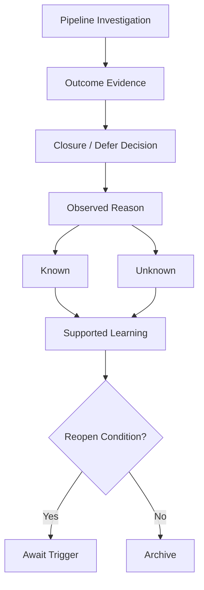

# Chapter 13 — Learning From Rejection, Closure, and Lost Opportunities

## Purpose

When an account does not become an engagement, what can we legitimately learn? Chapter 13 appends evidence-backed closure to Chapter 12 without erasing lifecycle history. It asks **“What do we actually know?”**, not “Why do we think they rejected us?” A closed investigation may be correct analytical work.

> **When the evidence does not explain why an opportunity ended, “unknown” is more accurate than a convenient story.**

## Learning objectives

After this chapter, you can distinguish closure from failure, known reasons from inferred possibilities, research closure from a stopped qualified engagement, local learning from generalization, and a legitimate reopen trigger from desire to retry.

## Closure versus failure

- **Closure ≠ Failure**
- **No Response ≠ Rejection**
- **Rejection ≠ Personal Failure**
- **Lost Engagement ≠ Competitor Win**
- **No Budget ≠ Assumed No Budget**
- **Internal Solution ≠ Our Solution Was Bad**
- **Timing ≠ Lack of Interest**
- **Hypothesis Refuted ≠ Bad Research**
- **Unknown ≠ Missing Analysis**

A refuted hypothesis can demonstrate excellent engagement-development work: the investigation found evidence and corrected an assumption.

## Closure reasons and evidence requirements

`ClosureReason` includes `HYPOTHESIS_REFUTED`, `NO_CURRENT_PRIORITY`, `NO_ACTIONABLE_IMPACT`, `INTERNAL_ONLY`, `EXTERNAL_HELP_NOT_ACCEPTED`, `OUT_OF_SCOPE`, `STAKEHOLDER_DECLINED`, `NO_RESPONSE_AFTER_STOPPING_RULE`, `INSUFFICIENT_EVIDENCE`, `TIMING_INACTIVE`, `PROJECT_CANCELLED`, `EXISTING_APPROACH_ADEQUATE`, `PROVIDER_NOT_FIT`, and `UNKNOWN`. The evaluator also represents `NO_BUDGET` and `NOT_INTERESTED` so unsupported proposals can be rejected explicitly.

Every specific reason requires sourced, known evidence. “Our internal engineering team is handling this and we are not considering outside assistance” supports `INTERNAL_ONLY`. No engagement plus no budget evidence does not support `NO_BUDGET`; record `UNKNOWN`. `UNKNOWN` is a complete, legitimate analytical result.

## Known versus inferred reasons

Closure evidence is labeled `KNOWN_CLOSURE_REASON`, `INFERRED_POSSIBILITY`, or `UNKNOWN`. “The project is postponed until next year” is known when a stakeholder says it. “Budget may have influenced it” remains an inferred possibility. The actual budget remains unknown. Inferences never become the official reason.

## Closure levels and careful “lost opportunity” terminology

- `RESEARCH_CLOSURE`: research produced no supported opportunity hypothesis.
- `OPPORTUNITY_CLOSURE`: a supported hypothesis existed but did not qualify.
- `QUALIFIED_ENGAGEMENT_CLOSURE`: an engagement candidate existed and later stopped.

These are not interchangeable “lost sales.” Pipeline states preserve `CLOSED_NO_OPPORTUNITY`, `DEFERRED`, `OUT_OF_SCOPE`, and `QUALIFIED_ENGAGEMENT_CLOSED` separately.

## Decision flow



## Executable scenarios

### Hypothesis refutation — Colonial Harbor Hotel

The hypothesis says multiple reservation channels may create synchronization work. The stakeholder reports that all channels feed one property-management platform automatically and require no manual reconciliation. `HYPOTHESIS_REFUTED` is an `OPPORTUNITY_CLOSURE`. Supported: the expected problem did not exist **in this account**. Unsupported: “Hotels do not need integration services.” Multiple systems do not automatically imply manual coordination.

### Internal-only

A stakeholder confirms workflow friction but says the internal development team owns it and outside firms are not used. `INTERNAL_ONLY` is supported. A real problem can exist without an external engagement. “Our offer is not valuable” is unsupported.

### No response

Chapter 11 permits initial outreach, follow-up, and close-the-loop. When all receive no response and the stopping rule completes, record `NO_RESPONSE_AFTER_STOPPING_RULE`. Known: no response was observed. Unknown: whether a message was read, interest, timing, budget, hypothesis correctness, and contact appropriateness. Never translate silence into `NOT_INTERESTED`.

### Timing inactive

“This is relevant, but we are not considering changes until next fiscal year” supports `TIMING_INACTIVE`. Existing semantics produce `DEFERRED`, with a `TIMING_TRIGGER` for next fiscal year. “Not now” is not “no forever.”

### Qualified engagement closure

Blue Heron previously reached `QUALIFIED_FOR_ENGAGEMENT`. The stakeholder then says its expansion project was cancelled and the workflow initiative stopped. This supports `PROJECT_CANCELLED` at `QUALIFIED_ENGAGEMENT_CLOSURE`. Competitor involvement and pricing remain unknown; the evidence does not establish a competitor win, bad pricing, or sales-process failure.

### Provider fit

Discovery finds a need for industrial control engineering beyond the Chapter 1 boundary. `PROVIDER_NOT_FIT` leads to `OUT_OF_SCOPE`. Qualification correctly prevented unsupported work: this is positive system behavior.

## Learning extraction and scope

`ClosureLearningExtractor` emits a lesson only when known evidence exists. Categories include market, account, signal, hypothesis, stakeholder, outreach, qualification, and process learning. Every emitted scenario lesson cites its evidence.

Learning scope is `ACCOUNT_SPECIFIC`, `SCENARIO_PATTERN`, or `GENERALIZABLE_ONLY_WITH_MORE_EVIDENCE`. One hotel with unified channels is account-specific. It cannot establish that hospitality companies generally use unified reservation systems. Multiple independent observations and an appropriate method would be needed for a broader claim.

## Unsupported counterfactual stories

Tempting explanations include “They went with a competitor,” “They thought we were too expensive,” “We contacted the wrong person,” “They were not technologically mature,” “They did not understand the value,” and “The message was not persuasive enough.” These belong under **UNSUPPORTED EXPLANATIONS** unless direct evidence supports them. They are not facts, reasons, or lessons.

## Closure retrospective

A deterministic retrospective shows account, final state, reason, knowns, unknowns, supported learning, prohibited conclusions, and reopen condition. For Colonial Harbor Hotel it preserves the unified-platform statement, leaves budget and other initiatives unknown, limits learning to this account, and permits reopening only for materially different workflow evidence.

## Reopen conditions

Valid triggers are `NEW_RELEVANT_SIGNAL`, `STAKEHOLDER_REQUEST`, `TIMING_TRIGGER`, `NEW_INITIATIVE`, and `NEW_PROBLEM_EVIDENCE`. Each condition needs a concrete description. “Try again later because we still want the account” supplies neither new evidence nor an explicit trigger and is invalid.

## Pipeline integration

`ClosureRecord` references the account and original `PipelineItem`, previous and final state, observed reason, evidence, stakeholder statements, unknowns, supported and unsupported lessons, optional reopen condition, date, closure level, and full state history. Closure appends one state event. It never deletes or rewrites Chapter 12 history. Timing remains deferred; provider boundary remains out of scope; stopped qualified work receives its own terminal state.

## CLI usage

```bash
python -m engagement_dev.cli chapter-13
```

The fixed report demonstrates refutation, stopping-rule silence, internal ownership, qualified project cancellation, rejection of an unsupported `NO_BUDGET` proposal, and a deterministic retrospective summary.

## Debugger exercise

Choose **Debug Chapter 13 Closure Reasoning**. Break on `unsupported_budget_evaluation` in `examples/debug_closure_reasoning.py`. Inspect proposed reason, supporting evidence, known facts, inferred possibilities, unknowns, closure level, supported learning, unsupported generalization, reopen condition, and recorded reason. Observe `NO_BUDGET` become `UNKNOWN` because the only budget statement is inferred.

## Interpretation

The evaluator is deliberately conservative and explainable. It checks sourced known statements for reason-specific evidence, keeps inferred possibilities visible, suggests `UNKNOWN` when evidence is insufficient, defers inactive timing, and distinguishes a stopped qualified engagement. It does not score sentiment, invent intent, or predict a sale.

## Common mistakes

- Calling every closed investigation a lost deal.
- Treating silence as rejection or no budget.
- Treating internal ownership as provider failure.
- Inferring competitor, price, or persuasion explanations.
- Generalizing one account to a market.
- Erasing old states when closing.
- Reopening from desire rather than a documented trigger.
- Treating `UNKNOWN` as incomplete work rather than accurate uncertainty.

## Connection to Chapter 14

Chapter 14 should be **Engagement Development Analytics and Continuous Improvement**. Its central question is: **Across many accounts, what does the evidence tell us about how our engagement-development process is working?** It should aggregate accounts, signals, hypotheses, outreach, conversations, qualification, closure, state durations, stopping-rule outcomes, and candidates without vanity metrics or fake causal claims. “20 messages produced 3 conversations” is observable; changed wording causing the result is not established without suitable evidence. Chapter 14 is recommended, not implemented.
