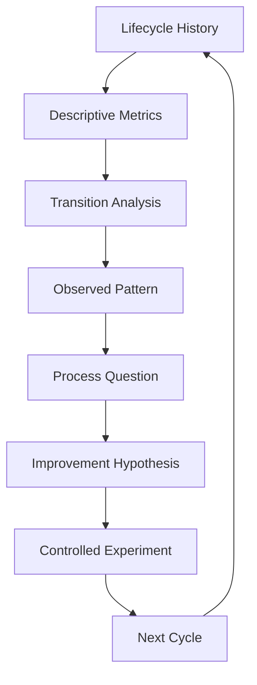

# Chapter 14 — Engagement Development Analytics and Continuous Improvement

## Purpose

Across many accounts, what does the evidence tell us about how our engagement-development process is working? Chapter 14 derives process analytics from the immutable pipeline histories and closure records created in Chapters 12 and 13. It asks what to investigate or change next; it is **not a predictive sales model**.

> **Analytics should generate better questions before they generate stronger claims.**

## Learning objectives

After this chapter, you can:

1. Build descriptive metrics without duplicating lifecycle state.
2. Read a funnel, transitions, time in state, outreach outcomes, and closures conservatively.
3. Separate recorded activity from evidence-producing activity.
4. Identify an explainable process bottleneck without inventing its cause.
5. Turn an observed pattern into an explicitly unvalidated improvement hypothesis.
6. Plan a small controlled experiment with guardrails and interpretation limits.



## Descriptive analytics and funnel representation

`EngagementDevelopmentHistory` contains references to existing `PipelineItem` and `ClosureRecord` values. `ProcessAnalyzer` reads those ledgers; it does not create an analytics-owned account history. `ProcessMetrics` reports accounts considered and researched, briefs, supported signals and hypotheses, stakeholder maps and conversations, outreach, qualification, candidates, handoffs, closures, and reopen conditions when those facts exist.

A funnel is a sequence of observed counts—candidate accounts → research → briefs → signals → hypotheses → conversations → qualification → candidates. A ratio, if displayed, is only an **observed rate within this deterministic scenario**, never a stable conversion probability.

**COUNT ≠ QUALITY.** **CONVERSATION ≠ QUALIFICATION.** **QUALIFICATION ≠ REVENUE.** **ENGAGEMENT CANDIDATE ≠ CLOSED SALE.** Revenue and closed deals are not modeled because the laboratory has no such evidence.

## Transition metrics

Adjacent `PipelineStateEvent` values supply transition counts such as `RESEARCHING → SIGNAL_FOUND`, `HYPOTHESIS_SUPPORTED → OUTREACH_READY`, and `AWAITING_RESPONSE → CONVERSATION_ACTIVE`. The same method exposes exits such as `AWAITING_RESPONSE → CLOSED_NO_OPPORTUNITY`. A count says where investigations stopped; it does not explain why.

## Time in state

Scenario days are the date difference between adjacent state events. The analyzer reports the arithmetic mean and observation count for each state. Shorter is not automatically better. Long `AWAITING_RESPONSE` durations could reflect follow-up policy, stakeholder timing, stale management, or ordinary delay. Analytics alone cannot choose among those explanations.

## Activity versus evidence yield

`ActivityEvent` remains distinct from `PipelineStateEvent`. The explicit classifier treats a useful evidence review or stakeholder conversation as evidence-producing, while duplicate review, note editing, drafting, and follow-up activity do not automatically produce evidence. Non-evidence-producing activity is a candidate for review—not proven waste.

**ACTIVITY ≠ PROGRESS.** **TOTAL ACTIVITY** is an operational count, not an opportunity-quality measure.

## Outreach analytics

Prepared messages, simulated attempts, observed replies, declines, and no response are descriptive outcomes. An observed response rate does **not** prove that message wording, stakeholder selection, or the offer caused the outcome, or that another message would behave similarly.

**RESPONSE RATE ≠ MESSAGE QUALITY.** Observed association is not causal proof.

## Market comparison

The market view compares scenario counts for researched accounts, supported hypotheses, and engagement candidates. “Hospitality produced more supported hypotheses in this scenario” is appropriately bounded. “Hospitality is universally better” is not. Investigate market characteristics, research quality, selection, sample size, and offer fit rather than ranking markets from a small exercise.

## Closure analytics

Closure counts use Chapter 13 records and preserve `UNKNOWN`, including zero when no unknown closure was observed. Many `NO_RESPONSE_AFTER_STOPPING_RULE` records can justify investigating relevance; they cannot establish poor outreach quality. Reopen conditions remain visible rather than being collapsed into a loss label.

## Vanity metrics

Connection count, email count, call count, meeting count, total accounts, and total activity can help operate a process. In isolation they are not indicators of successful engagement development. One hundred messages and ten deeply researched attempts describe different activity; this chapter makes no universal claim that either strategy is superior.

## Bottleneck analysis

`ProcessAnalyzer.bottleneck` returns a `BottleneckFinding` with a named pattern, the exact observed counts, a bounded interpretation, and `causal_explanation="UNKNOWN"`. An `OUTREACH_RESPONSE_BOTTLENECK` means that transition deserves investigation. It does not say message quality caused the observation.

## Correlation versus causation

The reasoning boundaries are explicit:

- **Metric ≠ Explanation**
- **Correlation ≠ Causation**
- **Response Rate ≠ Message Quality**
- **Activity ≠ Progress**
- **Small Sample ≠ General Rule**

Analytics tells us what happened. It helps us ask what to investigate. Without additional evidence it usually cannot establish why it happened.

## Improvement hypotheses and experiments

An `ImprovementHypothesis` is a falsifiable process proposition and always begins `UNVALIDATED`. The scenario asks whether a signal-specific opening may produce more substantive responses than a generic capability-led opening.

`ImprovementExperiment` records the changed variable, comparison condition, observable outcomes, guardrails, deterministic result, and interpretation limits. A favorable Cycle B result supports further testing; it does not prove universal superiority.

## Small-sample limitations

Every report is `DESCRIPTIVE_ONLY`; fewer than 30 considered accounts also produces `INSUFFICIENT_SAMPLE`. The threshold is an educational safeguard, not statistical significance testing. No close probability is calculated.

## Cycle retrospective and improvement plan

`CycleRetrospective` connects metrics, a primary finding, what worked, unknowns, the hypothesis, and the next plan. The immutable `ImprovementPlan` permits no more than two changed variables. This scenario changes only the outreach opening while keeping the supported offer, qualification policy, and stopping rules constant.

## Executable scenario and CLI usage

Run:

```bash
python -m engagement_dev.cli chapter-14
```

The deterministic dashboard shows the funnel, transitions, time in state, closure reasons (including `UNKNOWN`), activity/evidence counts, market comparisons, bottleneck evidence, hypothesis status, experiment limits, and explicit “Not modeled” outputs for deals and revenue.

## Debugger exercise

Choose **Debug Chapter 14 Process Analytics** in VS Code. Inspect `lifecycle_history`, `stage_transition`, `activity_event`, `evidence_producing_classification`, `bottleneck_evidence`, `improvement_hypothesis`, and `experiment`. Set the documented breakpoint in `ProcessAnalyzer.improvement_hypothesis`: values above it are **DATA**; the proposition created there is **INTERPRETATION**.

## Interpretation

The dashboard is a retrospective instrument, not a forecast or a performance verdict. Its safest output is a bounded process question and a controlled next-cycle test.

## Common mistakes

- Duplicating lifecycle facts into mutable analytics stages.
- Treating an observed ratio as a probability or causal effect.
- Hiding `UNKNOWN` closures.
- Ranking markets universally from scenario counts.
- Calling non-evidence-producing activity waste.
- Validating an improvement hypothesis merely by creating it.
- Changing many variables at once.
- Inventing revenue, deal value, or close probability.

## Connection to Chapter 15

Continue with **Chapter 15 — Engagement Development Simulator**, the implemented Volume I capstone. It orchestrates Chapters 0–14 from an empty multi-account pipeline to evidence-based outcomes, including legitimate closure, deferral, refutation, more discovery, and even **0 qualified engagements**.
