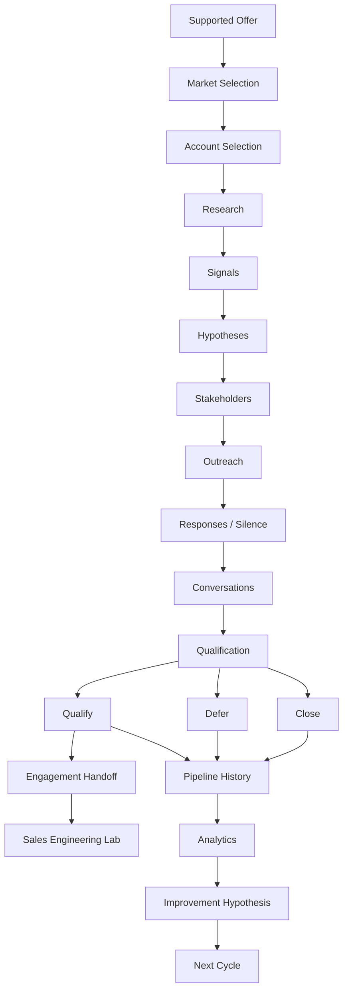

# Chapter 15 — Engagement Development Simulator


## Purpose

This Volume I capstone asks: **Can we run the entire engagement-development process from an empty pipeline to evidence-based outcomes across multiple accounts?** `EngagementDevelopmentSimulator` orchestrates the chapter services and immutable records; it is not a second implementation of them.

> **A good engagement-development system should sometimes tell you not to pursue an engagement.**

## Learning objectives

After this chapter, you can trace a complete deterministic cycle, explain why accounts branch, audit evidence provenance and stopping rules, distinguish pipeline state from closure reason, validate architecture invariants, and use descriptive analytics to propose—rather than prove—an improvement.

## Capstone architecture



The downstream laboratory is a boundary, not code in this repository. A qualification handoff is not a solution, architecture, closed deal, revenue forecast, or customer approval.

## Configuration and phases

`SimulationConfig` fixes the named scenario, 2026-08-10 start date, research, outreach, conversation and handoff capacities, follow-up policy, and cycle count. There is no random behavior. Named fixtures provide observed evidence.

The readable phase vocabulary is: **Offer → Market Selection → Account Selection → Research → Signal Analysis → Hypothesis Formation → Stakeholder Mapping → Outreach → Response Handling → Conversation → Qualification → Follow-Up → Pipeline Review → Closure → Analytics → Improvement**. An account exits as soon as evidence supports an exit; it need not visit every phase.

## Event ledger, timeline, and branch tracing

Each `SimulationEvent` records a scenario date, event type, account, optional actor, source chapter, evidence identifiers, prior and resulting state, and explanation. Pipeline histories remain the authoritative lifecycle history. The simulator projects those histories into a single ordered ledger.

The fixed start makes the timeline inspectable: day 1 selects the supported market and begins account work; subsequent scenario days record evidence-supported research, signals, hypotheses, conversations, qualification, stopping-rule closure, and handoff. Dates communicate ordering and provenance, not a claim about typical sales duration.

Example branches are visible directly in history:

* **Blue Heron Resort:** `RESEARCHING → SIGNAL_FOUND → HYPOTHESIS_SUPPORTED → STAKEHOLDER_MAPPED → OUTREACH_READY → CONVERSATION_ACTIVE → MORE_DISCOVERY_NEEDED → QUALIFIED_FOR_ENGAGEMENT`.
* **Colonial Harbor Hotel:** research and a supported hypothesis lead to conversation evidence that refutes the hypothesis, then `CLOSED_NO_OPPORTUNITY` with `HYPOTHESIS_REFUTED`.
* **Peninsula Home Services:** simulated outreach, policy-supported follow-up, observed silence, and the stopping action lead to `NO_RESPONSE_AFTER_STOPPING_RULE`—not “not interested.”
* **Harbor Street Music:** remains `DEFERRED` when attention is allocated elsewhere.
* **Peninsula Industrial Controls:** becomes `OUT_OF_SCOPE` because the discovered industrial-controls work crosses the Chapter 1 provider boundary.
* **Tidewater Inn:** remains `MORE_DISCOVERY_NEEDED`; incomplete evidence is distinct from qualification.

## Portfolio scenarios

### Productive cycle

Blue Heron crosses the Chapter 10 threshold and receives the existing `EngagementHandoff`. Other accounts close, defer, leave scope, or remain unresolved. One positive outcome does not invalidate the negative or incomplete findings.

### Zero-engagement cycle

No account qualifies. Supported investigations are refuted, closed by stopping rule, found outside provider fit, deferred, or left needing discovery. The simulator reports `SUCCESSFUL` because it preserved boundaries and did not manufacture an opportunity.

**Zero Engagements ≠ Failed Process**

**The process worked because it prevented false opportunities.**

### Capacity-constrained cycle

Two research slots and one conversation slot make opportunity cost explicit. Unselected accounts are `DEFERRED`, not rejected. Their evidence is not rewritten to rationalize the allocation.

## Evidence ledgers and outcome taxonomy

Every account ledger separates public evidence, signals, stakeholder evidence, current problem understanding, qualification evidence, unknowns, final outcome, and optional closure reason. Final states include `QUALIFIED_FOR_ENGAGEMENT`, `MORE_DISCOVERY_NEEDED`, `DEFERRED`, `CLOSED_NO_OPPORTUNITY`, and `OUT_OF_SCOPE`. Closure reasons remain separate from pipeline state and include refutation, no response after the stopping rule, current priority, and provider fit.

## Success criteria and invariants

Success means provenance, lifecycle boundaries, stopping rules, qualification rules, capacity, evidence-backed closure, history-derived analytics, and explainable next actions all remain intact. It is **not** judged by engagement count.

`SimulationInvariantChecker` rejects unsupported hypotheses; fabricated authority or outreach claims; conversations without statements; incomplete or fabricated qualification; candidates without `QUALIFIED_FOR_ENGAGEMENT`; unsupported closure reasons; prohibited follow-up; unsupported promotion; premature solution assumptions; fake close probabilities or revenue forecasts; capacity violations; and analytics that do not reproduce from history.

The normal fixtures pass all checks. `examples/debug_chapter_15_invariant_failure.py` deliberately creates an invalid isolated candidate so learners can inspect rejection without contaminating runtime data.

## Qualification handoff

Only the productive and mixed fixtures can reuse Chapter 10's `EngagementCandidate` and `EngagementHandoff`, and only after the qualification threshold passes:

```text
SIMULATOR OUTPUT
Engagement Candidate + Engagement Handoff
↓
INPUT TO DOWNSTREAM SALES ENGINEERING LABORATORY
```

The simulator does not select a solution or implement the downstream engagement.

## Analytics and improvement loop

At cycle end, Chapter 14's `ProcessAnalyzer` derives the descriptive funnel, transitions, closure reasons, evidence-producing activity and bottleneck from `EngagementDevelopmentHistory`. It then creates a falsifiable improvement hypothesis and one controlled next-cycle experiment:

**Cycle 1 → Analytics → Improvement Plan → Cycle 2**

The plan stays `UNVALIDATED`. An observed pattern is not a causal explanation, and this chapter does not run an endless loop.

## Executable CLI

```bash
python -m engagement_dev.cli chapter-15
python -m engagement_dev.cli chapter-15 --scenario productive
python -m engagement_dev.cli chapter-15 --scenario zero-engagement
python -m engagement_dev.cli chapter-15 --scenario capacity-constrained
```

All commands are deterministic. Use **Debug Chapter 15 Engagement Development Simulator** to inspect the current account, phase, evidence, pipeline state, selected subsystem, event, capacity, and outcome. Use **Debug Chapter 15 Invariant Failure** to step through a rejected invalid fixture.

## Interpretation and common mistakes

Do not equate process quality with a guaranteed outcome, more activity with qualification, more accounts with engagements, research with customer pain, outreach with response, conversation with qualification, or qualification with a closed deal. Do not convert silence into rejection, capacity deferral into prospect quality, descriptive analytics into causation, or a handoff into a proposed solution.

## Volume I conclusion

**PROCESS QUALITY ≠ GUARANTEED OUTCOME**  
**MORE ACTIVITY ≠ MORE QUALIFICATION**  
**MORE ACCOUNTS ≠ MORE ENGAGEMENTS**  
**GOOD RESEARCH ≠ CUSTOMER PAIN**  
**GOOD OUTREACH ≠ RESPONSE**  
**GOOD CONVERSATION ≠ QUALIFICATION**  
**QUALIFIED ENGAGEMENT ≠ CLOSED DEAL**  
**ZERO ENGAGEMENTS ≠ FAILED SIMULATION**

Volume I ends with justified knowledge and, only when the evidence permits it, an evidence-backed Engagement Handoff.
